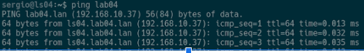
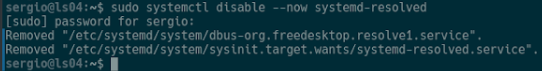
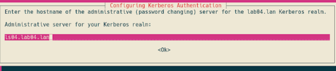
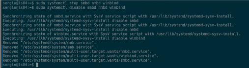

cat <<'EOF' > README.md
# Linux Server – Ubuntu + Samba Active Directory Domain Controller

## Sprint 1 – Lab Activity  
**Linux Server (Ubuntu Server) + Samba AD DC**

## 1. Virtual Machine Creation

Create a virtual machine with the following specifications:

- **OS:** Ubuntu Server 22.04 or 24.04  
- **RAM:** 4 GB  
- **CPUs:** 2  
- **Disk:** 40 GB  
- **Network Adapters:** 2  

## 2. VirtualBox Network Configuration

### Adapter 1 – INTERNET
- **Enabled**
- **Attached to:** Bridged Adapter  
- **Purpose:**  
  - Internet access  
  - Real IP from the physical network  

**Server IP:**  
172.30.20.39

### Adapter 2 – DOMAIN NETWORK
- **Enabled**
- **Attached to:** Internal Network  
- **Name:** intnet  
- **Purpose:**  
  - Internal traffic for future domain clients  

---

## 3. Ubuntu Server Installation and Network Configuration

### Server Setup
- **Hostname:** ls04  
- **Username:** Sergio  
- **Password:** admin_21  

## 4. Network Configuration (Netplan)

Edit Netplan configuration:

sudo nano /etc/netplan/50-cloud-init.yaml

### Bridged Adapter (Internet)

addresses: 172.30.20.39/16  
gateway4: 172.30.20.1  
DNS: 10.239.3.7, 10.239.3.8  

### Internal Network Adapter (Domain)

addresses: 192.168.10.37/24  
DNS: 127.0.0.1  

Apply changes:

sudo netplan apply

## 5. Why Use a FQDN?

- Active Directory depends on Kerberos
- Kerberos requires a Fully Qualified Domain Name (FQDN)
- Samba DNS registers services using FQDN
- Without it, samba-tool domain provision may fail

---

## 6. Configure Hostname and Hosts File

Set hostname:

sudo hostnamectl set-hostname ls04

Edit hosts file:

sudo nano /etc/hosts

Add server IP and hostname.

Reboot:

sudo reboot

Verify:

ping ls04

## 7. Install SSH (Optional)

sudo apt install openssh-server

## 8. Prepare Server for Samba AD

Disable systemd-resolved:

sudo systemctl disable --now systemd-resolved

Remove symlink:

sudo unlink /etc/resolv.conf

Create resolv.conf:

sudo nano /etc/resolv.conf

Make immutable:

sudo chattr +i /etc/resolv.conf

## 9. Install Samba and Dependencies

sudo apt update  
sudo apt install samba winbind smbclient krb5-user dnsutils -y

## 10. Disable Classic Samba Services

sudo systemctl stop smbd nmbd winbind  
sudo systemctl disable smbd nmbd winbind  

Enable Samba AD DC:

sudo systemctl unmask samba-ad-dc  
sudo systemctl enable samba-ad-dc  

## 11. Backup Samba Configuration

sudo mv /etc/samba/smb.conf /etc/samba/smb.conf.bak

## 12. Provision Samba Active Directory

sudo samba-tool domain provision

Copy Kerberos config:

sudo cp /var/lib/samba/private/krb5.conf /etc/krb5.conf

## 13. Start Samba AD DC

sudo systemctl start samba-ad-dc  
sudo systemctl status samba-ad-dc  

## 14. Configure Time Synchronization (NTP)

Install Chrony:

sudo apt install chrony

Set permissions:

sudo chown root:_chrony /var/lib/samba/ntp_signd  
sudo chmod 750 /var/lib/samba/ntp_signd  

Edit Chrony config:

sudo nano /etc/chrony/chrony.conf

Add:

bindcmdaddress 192.168.10.37  
allow 192.168.10.1/24  
ntpsigndsocket /var/lib/samba/ntp_signd  

Restart Chrony:

sudo systemctl restart chronyd  
sudo systemctl status chronyd  

## 15. Verify Domain Records

host -t A lab04.lan  
host -t A ls04.lab04.lan  

Kerberos and LDAP:

host -t SRV _kerberos._udp.lab04.lan  
host -t SRV _ldap._tcp.lab04.lan  

## 16. Verify Samba Shares

smbclient -L lab04.lan -N

## 17. Final Validation – Kerberos

Authenticate:

kinit administrator@LAB04.LAN

Password:

admin_21

Verify ticket:

klist

