# Creación de el nuevo linux server.

## Configurar el archivo:

```bash
sudo nano /etc/netplan/50-cloud-init.yaml
```

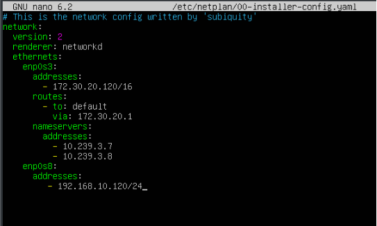

```yaml
network:
  version: 2
  renderer: networkd
  ethernets:
    enp0s3:
      addresses:
        - 172.30.20.120/16
      routes:
        - to: default
          via: 172.30.20.1
      nameservers:
        addresses:
          - 10.239.3.7
          - 10.239.3.8
    enp0s8:
      addresses:
        - 192.168.10.120/24
```

## Reiniciar:

```bash
sudo netplan apply
```

## Configurar el hostname y la IP fija.

```bash
sudo hostnamectl set-hostname ls204
```

## Reiniciar

```bash
reboot
```

---

## Instalar el SSH:

```bash
sudo apt install openssh-server
ssh sergio@172.30.20.120
```

**Luego dentro de:**

```bash
sudo nano /etc/hosts
```

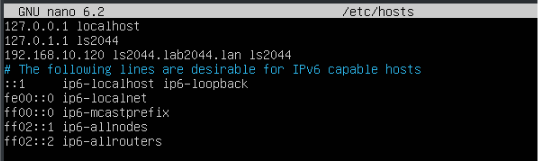

**Verificar haciendo ping al nombre ls204 automáticamente tengo respuesta.**

---

**Antes debo deshabilitar el archivo resolved**

```bash
sudo systemctl disable --now systemd-resolved
```
Es donde apunta a mi servidor para resolver los nombres de dominios ya que voy a implementar el servidor samba por que es incompatible.

Lo siguiente es eliminar el enlace simbólico:
```bash
sudo unlink /etc/resolv.conf
```
Las modificaciones que se hagan en este ya no se hagan si no en el verdadero.

Crear un nuevo fichero resolv.conf:
```bash
sudo nano /etc/resolv.conf
```

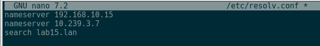

## Con los siguientes comandos instalar samba:

```bash
sudo apt update

sudo apt install -y acl attr samba samba-dsdb-modules samba-vfs-modules smbclient winbind libpam-winbind libnss-winbind libpam-krb5 krb5-config krb5-user dnsutils chrony net-tools

```

Durante la instalación pedirá el dominio de servidores para kerberos, poner el dominio: `lab2044.lan`

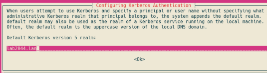

**ls2044.lab2044.lan**

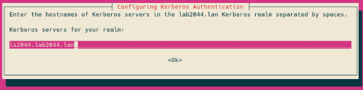

**ls2044.lab2044.lan**

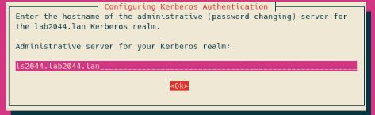

---

## Deshabilitar servicios Samba clásicos

Detener y deshabilitar los servicios que Active Directory que no se van a usar.

```bash
sudo systemctl stop smbd nmbd winbind
sudo systemctl disable smbd nmbd winbind
```

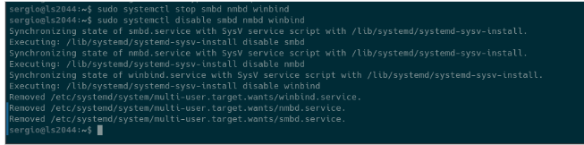

---

**El servidor solo necesita samba ad-dc para funcionar como Active Directory:**

```bash
sudo systemctl unmask samba-ad-dc
sudo systemctl enable samba-ad-dc
```

**Crear una copia de seguridad del archivo:**

```bash
sudo mv /etc/samba/smb.conf /etc/samba/smb.conf.bak
```

## Provisionar el AD Samba:

**Ejecutar provisionado:**

```bash
sudo samba-tool domain provision
```

> dns es 10.239.3.7

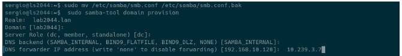

**Crear copia de seguridad de la configuración predeterminada de kerberos:**

```bash
sudo mv /etc/krb5.conf /etc/krb5.conf.orig
```

**Reemplazar con el archivo /var/lib/samba/krb5.conf:**

```bash
sudo cp /var/lib/samba/private/krb5.conf /etc/krb5.conf
```

No edite nada lo deje porque ya estaba configurado:

```bash
sudo nano /etc/krb5.conf
```

---

## Activar el controlador de dominio:

**Iniciar servicio samba Active Directory samba-ad-dc:**

```bash
sudo systemctl start samba-ad-dc
```

**Comprobar servicios:**

```bash
sudo systemctl status samba-ad-dc
```

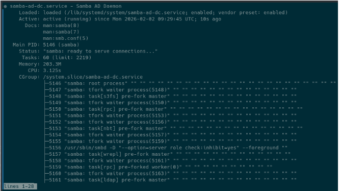

**Cambiar el permiso y la propiedad predeterminados del directorio /var/lib/samba/ntp_signd:**

```bash
sudo chown root:_chrony /var/lib/samba/ntp_signd
sudo chmod 750 /var/lib/samba/ntp_signd
```


**Modificar el archivo de configuración /etc/chrony/chrony.conf:**

```bash
sudo nano /etc/chrony/chrony.conf
```

**Al final de todo agregar esto:**

```
bindcmdaddress 192.168.10.37
allow 192.168.10.0/24
ntpsigndsocket /var/lib/samba/ntp_signd
```

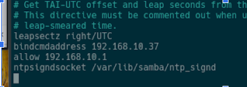

**Reiniciar chrony:**

```bash
sudo systemctl restart chronyd
```

**Verificar:**

```bash
sudo systemctl status chronyd
```

**Verificar nombres de dominio:**

```bash
host -t A lab04.lan
host -t A ls04.lab04.lan
```

**Verificar que los registros de servicios kerberos y ldap apunten al FQDN:**

```bash
host -t SRV _kerberos._udp.lab04.lan
host -t SRV _ldap._tcp.lab04.lan
```

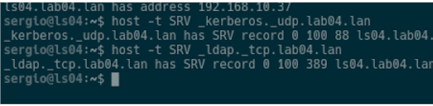

**Verificar que los recursos predeterminados están disponibles en Samba Active Directory:**

```bash
smbclient -L lab04.lan -N
```

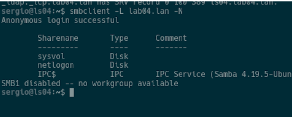

---

## Validación Final:

**Comprobar autenticación en el servidor de kerberos mediante el administrador:**

```bash
kinit administrator@LAB2044.LAN
klist
```

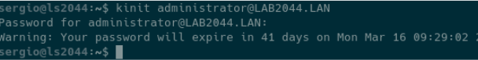

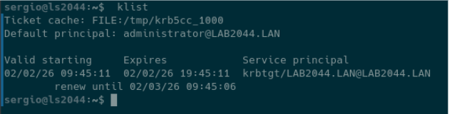

---

# Cliente Linux

## Configurar nombre del equipo:

```bash
sudo hostnamectl set-hostname lc04
```

## Configurar red del equipo:

Ahora hay que configurar la red como lo pone en las imágenes y recuerda en (IPV4).

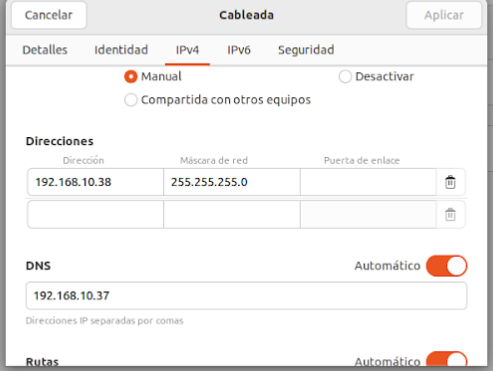

**Ahora comprobamos haciendo un ping:**

**Cliente:**

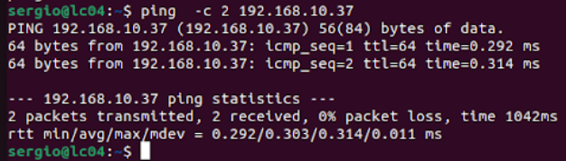

**Server:**

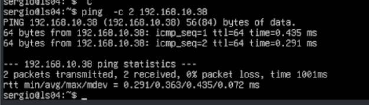

**Ahora configuramos el archivo:**

```bash
sudo nano /etc/hosts
```

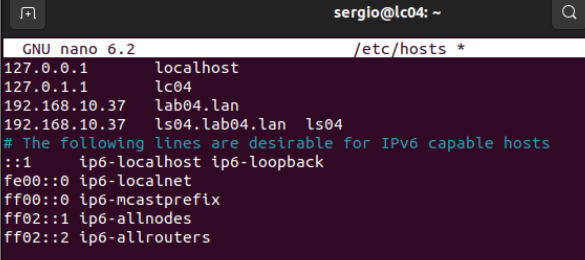

**Comprobación:**

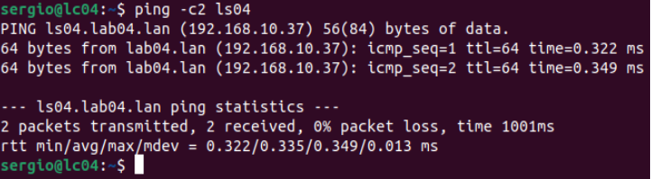

---

**Ahora toca la configuración de netplan:**

Primero poner en modo root:

```bash
sudo su
```

**Después comprobar siguiente:**

```bash
ip route
```


**Verificar haciendo ping al servidor con IP, DNS y conexión a internet.**

Si aún no hay conexión a internet ver estas configuraciones.

**Verifica que el servidor tenga activado el reenvío IP:**

```bash
sudo nano /etc/sysctl.conf
```

Añadir al final:

```
net.ipv4.ip_forward=1
```

**Aplicar y comprobar:**

```bash
sudo sysctl -p
sysctl net.ipv4.ip_forward
```

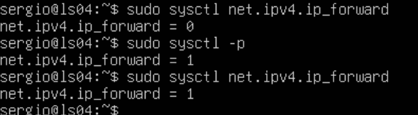

---

**Configurar NAT correctamente en el servidor:**

```bash
sudo iptables -t nat -A POSTROUTING -o enp0s3 -j MASQUERADE
```

**Comprobar:**
```bash
sudo iptables -t nat -L -n -v
```

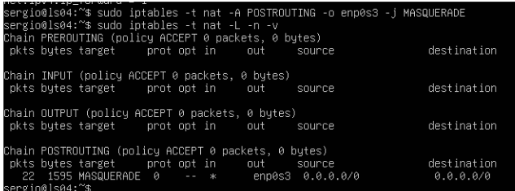

**Comprueba internet en el cliente.**

Instalación del paquete NTPDATE (en el cliente) y estar en root > `sudo su`

```bash
sudo apt update
sudo apt-get install ntpdate
```

Esto sirve para sincronizar los relojes de las máquinas y puedan unirse al dominio sincronizados.

Comprobar con:
```bash
sudo ntpdate -q lab04.lan
```

Esto significa que hay una diferencia de -0.010688 segundos, con el siguiente comando voy a sincronizar:
```bash
sudo ntpdate lab15.lan
```

## Instalar paquetes necesarios en Ubuntu Desktop:

```bash
sudo apt update
sudo apt-get install samba krb5-config krb5-user winbind libpam-winbind libnss-winbind
```

Si te da fallo usa esto:

```bash
sudo systemctl stop unattended-upgrades
sudo kill -9 4363
sudo dpkg --configure -a
sudo apt-get install samba krb5-config krb5-user winbind libpam-winbind libnss-winbind
```
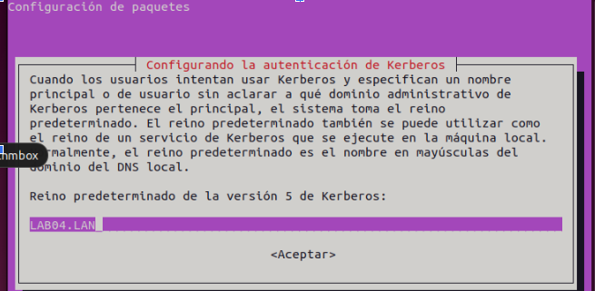

```bash
kinit administrator@LAB04.LAN
klist
```

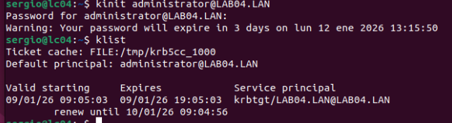


**Mover archivo smb.conf y crear copia de seguridad.**

```bash
sudo mv /etc/samba/smb.conf /etc/samba/smb.conf.initial
```

```bash
sudo nano /etc/samba/smb.conf
```

Agregar lo siguiente en el nuevo:

```ini
[global]
    workgroup = LAB15
    realm = LAB15.LAN
    netbios name = lc15
    security = ADS
    dns forwarder = 192.168.10.15

idmap config * : backend = tdb
idmap config *:range = 50000-1000000

    template homedir = /home/%D/%U
    template shell = /bin/bash
    winbind use default domain = true
    winbind offline logon = false
    winbind nss info = rfc2307
    winbind enum users = yes
    winbind enum groups = yes

    vfs objects = acl_xattr
    map acl inherit = Yes
    store dos attributes = Yes
```

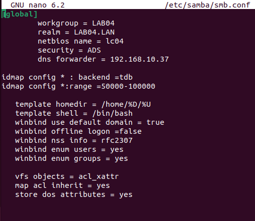

---

**Reiniciar los demonios de samba:**

```bash
sudo systemctl restart smbd nmbd
```

Detener los servicios que no son necesarios dentro de ubuntu desktop:

```bash
sudo systemctl stop samba-ad-dc
```

Lo siguiente es habilitar los servicios de samba que se van a necesitar con:

```bash
sudo systemctl enable smbd nmbd
```


**Unir Ubuntu desktop a SAMBA AD DC:**

Con el siguiente comando uniré el ubuntu desktop a mi dominio LAB04.LAN:

```bash
sudo net ads join -U administrator
```

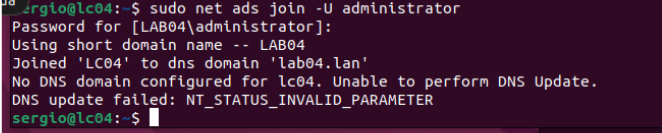

**Servidor:**

Entrar como root: `sudo su`

Ejecutar este comando:
```bash
sudo samba-tool computer list
```

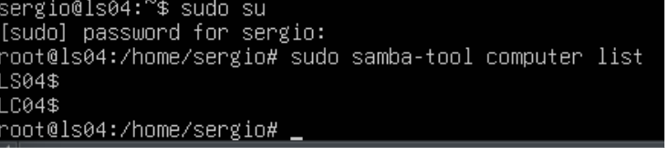

## CONFIGURAR AUTENTICACIÓN DE CUENTAS AD (cliente)

```bash
sudo nano /etc/nsswitch.conf
```

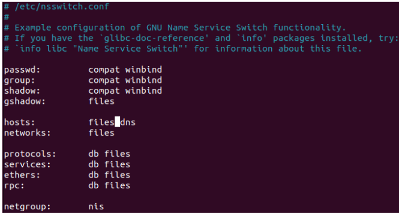

Si quieres que esté más actualizado pon file:

```
passwd: files winbind
group:  files winbind
shadow: files winbind
hosts:  files dns
```

(cambiar a files winbind) PRUEBA

**Reiniciar:**

```bash
sudo systemctl restart winbind
```

**Listar usuarios y grupos del dominio:**

```bash
wbinfo -u
wbinfo -g
```

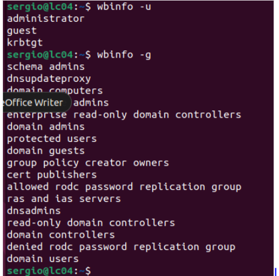

---

**Verificar el módulo de winbind para tener el usuario administrator dentro del equipo:**

```bash
sudo getent passwd | grep administrator
id administrator
```

Configurar pam-auth-update para autenticarnos con cuentas de dominio y que se creen automáticamente los directorios:

```bash
sudo pam-auth-update
```

Marcar la opción de: **Create home directory on login**

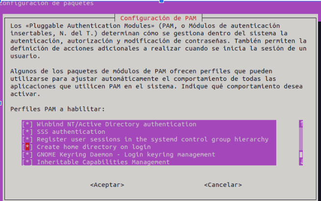

**Editar el archivo para crear automáticamente los directorios cuando me logue:**

```bash
sudo nano /etc/pam.d/common-account
```

Agregar al final de todo la siguiente línea:

```
session required pam_mkhomedir.so skel=/etc/skel/ umask=0022
```

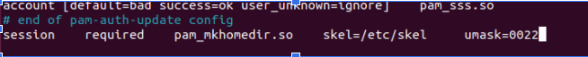

**Autenticarse con cuenta de usuario samba4 AD.** Ingreso con usuario administrator y como está en la imagen he ingresado con el usuario administrator desde cli-ssd (ubuntu desktop).

El administrator no podrá usar sudo porque no está en el grupo sudoers. Para darle privilegios, en el root de la máquina usar:

```bash
sudo usermod -aG sudo administrator
```

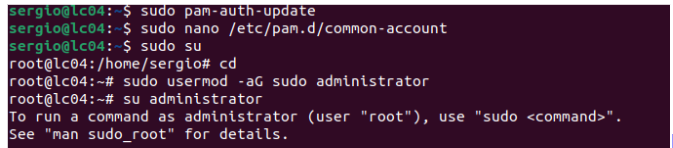

Ahora si quiero loguearme con el usuario administrator del servidor ubuntu con interfaz gráfica, cierro la sesión y entro con `administrator@lab04.lan`.

---

# GESTIÓN DE USUARIOS Y GRUPOS EN SAMBA ACTIVE DIRECTORY y GPO

Desde el servidor Samba crear los grupos con su ámbito y usuarios:

```bash
sudo samba-tool group add IT_departaments --group-scope=Universal --group-type=Security
```

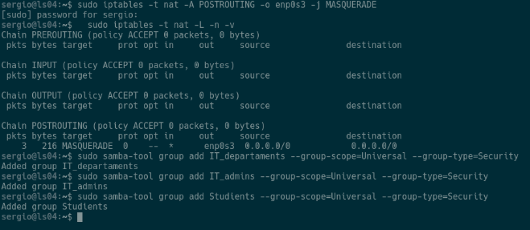

**Crear los usuarios:**

```bash
sudo samba-tool user create alice
```

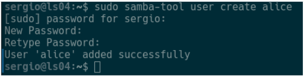

**Añadir los usuarios a los grupos correspondientes:**

```bash
sudo samba-tool group addmembers IT_admins Alice
```

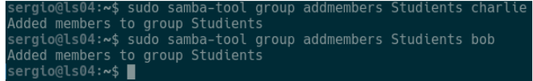

**Crear Unidades Organizativas:**

```bash
sudo samba-tool ou create "OU=IT_departaments,DC=lab04,DC=lan"
```

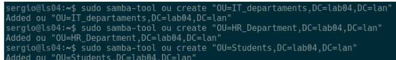

---

## Mover Usuarios y Grupos a sus OUs:

**Usuario:**

```bash
sudo samba-tool user move alice "OU=IT_departaments,DC=lab04,DC=lan"
sudo samba-tool user move bob "OU=Students,DC=lab04,DC=lan"
sudo samba-tool user move charlie "OU=HR_Department,DC=lab04,DC=lan"
```

**Grupos:**

```bash
sudo samba-tool group move IT_admins "OU=IT_departaments,DC=lab04,DC=lan"
sudo samba-tool group move Studients "OU=Students,DC=lab04,DC=lan"
sudo samba-tool group move IT_departaments "OU=HR_Department,DC=lab04,DC=lan"
```

**Verificar:**

```bash
sudo samba-tool ou list
```

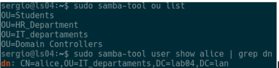

---

**Crear la GPO en el Servidor Samba:**

Samba permite crear el objeto GPO aunque sea para clientes Linux.

```bash
sudo samba-tool gpo create "IT_Security_Policy" -U Administrator
```

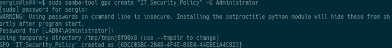

**Crear la PSO para la OU de IT_departaments:**

```bash
sudo samba-tool domain passwordsettings pso create "PSO_IT_Estricta" 10 \
  --account-lockout-threshold=3 \
  --account-lockout-duration=5 \
  --reset-account-lockout-after=5 \
  -U Administrator
```

Este comando define las reglas de 3 intentos y 5 minutos de bloqueo.


**Aplicar la SPO al grupo:**

```bash
sudo samba-tool domain passwordsettings pso apply "PSO_IT_Estricta" "it_admins" -U Administrator
```

---

# SPRINT 3 Creación y compartición de carpeta

## 1. En el Servidor: Crear carpetas (Finance, HRdosc, Public) y configurar Samba

```bash
sudo mkdir -p /srv/samba/Finance
sudo mkdir -p /srv/samba/HRdosc
sudo mkdir -p /srv/samba/Public
```


> Dns del instituto: 10.239.3.7

Configurar el recurso en `sudo nano /etc/samba/smb.conf`, añadir al final del archivo:

```ini
[Finance]
    path = /srv/samba/Finance
    read only = No

[HRdocs]
    path = /srv/samba/HRdocs
    read only = No

[Public]
    path = /srv/samba/Public
    read only = No
```

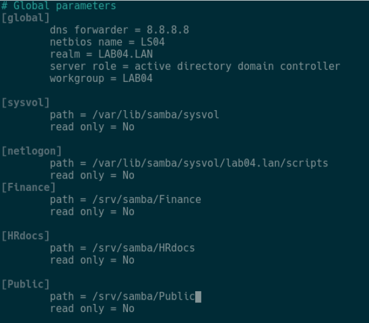

**Reiniciar samba:**

```bash
sudo systemctl restart smbd
```

---

## 2. En el Servidor: Aplicar Permisos de Disco (ACLs)

Primero instalar las herramientas de ACLs:

```bash
sudo apt update && sudo apt install acl -y
sudo setfacl -m g:"LAB04\IT_admins":rwx /srv/samba/Finance
```

Al ejecutar el comando para dar los permisos a las carpetas tendré problemas de argumentos inválidos, ver algunas comprobaciones:

```bash
getent group | grep -i IT_admins
```

Modificar `sudo nano /etc/samba/smb.conf` añadir las siguientes líneas específicas para controladores de dominio:

```ini
#Añadir estas líneas para el mapeo
winbind enum users = yes
winbind enum groups = yes
winbind use default domain = yes

idmap_ldb:use xid = yes
winbind enum users = yes
winbind enum groups = yes
winbind use default domain = yes
```

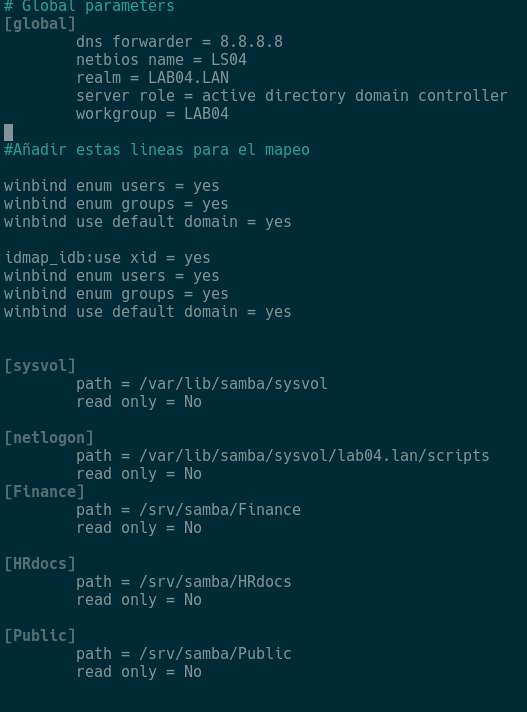

**Forzar la vinculación de librerías NSS:**

```bash
sudo ln -sf /lib/x86_64-linux-gnu/libnss_winbind.so.2 /lib/x86_64-linux-gnu/libnss_winbind.so
sudo ldconfig
```

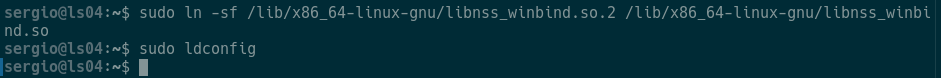

**Limpieza de Caché y Reinicio Total:**

```bash
# Detener el servicio
sudo systemctl stop samba-ad-dc

# Limpiar cachés de identidades
sudo net cache flush
sudo rm -f /var/lib/samba/*.tdb
sudo rm -f /var/lib/samba/group_mapping.tdb

# Iniciar el servicio
sudo systemctl start samba-ad-dc
```

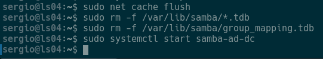

```bash
# Ahora este comando NO fallará
sudo setfacl -m g:it_admins:rwx /srv/samba/Finance
```

### Si te falla, intenta esto:

```bash
getent group it_admins
getent group "LAB04\it_admins"
```

Si te salen los grupos, prueba esto:

```bash
sudo nano /etc/nsswitch.conf
```

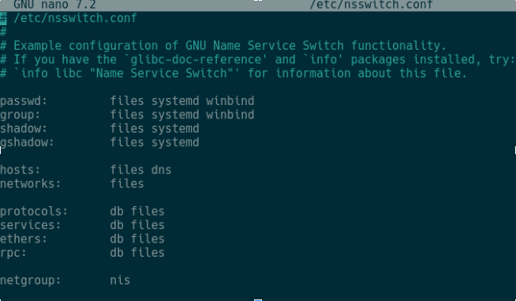

Para que Linux entienda lo que dice winbind, instálala con:

```bash
sudo apt update
sudo apt install libnss-winbind libpam-winbind
```

Ahora reinicia los servicios:

```bash
sudo systemctl restart winbind
sudo systemctl restart smbd nmbd
```

Ahora ejecuta de nuevo:

```bash
getent group "LAB04\it_admins"
```

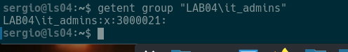

### Ejecutar el setfacl correctamente

Una vez que `getent` funcione, lanza el comando de esta forma (usando comillas simples para que la barra `\` no dé problemas):

```bash
sudo setfacl -m 'g:LAB04\it_admins:rwx' /srv/samba/Finance
sudo setfacl -m g:it_admins:rwx /srv/samba/HRdosc
sudo setfacl -m g:it_admins:rwx /srv/samba/Public
```


### Permisos para Studients (Bob - Acceso restringido)

Bob y su grupo solo pueden modificar Public. En las demás, solo pueden ver el contenido (lectura y ejecución para entrar en la carpeta).

```bash
# En Public: Permiso de Lectura y Escritura
sudo setfacl -m g:studients:rwx /srv/samba/Public

# En Finance y HRdocs: Solo Lectura (rx)
sudo setfacl -m g:studients:rx /srv/samba/Finance
sudo setfacl -m g:studients:rx /srv/samba/HRdosc
```

### 3. Permisos para IT_departaments (Charlie - Acceso Selectivo)

Charlie puede modificar su carpeta de RRHH y la pública, pero no tiene acceso a Finanzas.

```bash
# En HRdocs: Permiso de Lectura y Escritura
sudo setfacl -m g:it_departaments:rwx /srv/samba/HRdosc

# En Public: Permiso de Lectura y Escritura
sudo setfacl -m g:it_departaments:rwx /srv/samba/Public

# En Finance: Denegar acceso total (quitar todos los permisos)
sudo setfacl -m g:it_departaments:--- /srv/samba/Finance
```

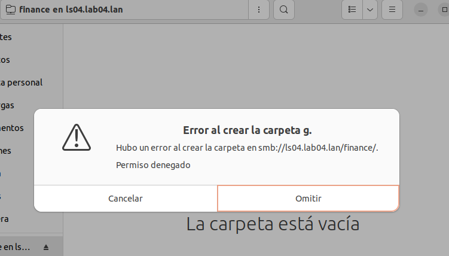

---

## Preparación del Disco (Equivalente a Administración de Discos)

Agregar un disco de 10Gb e identificar en el servidor:

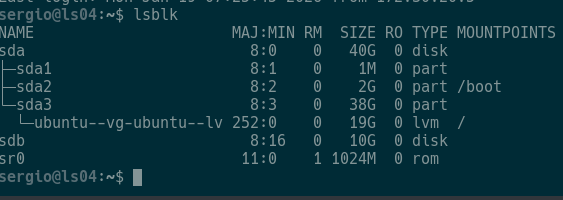

**Crear tabla de particiones GPT y una partición primaria:**

```bash
sudo parted /dev/sdb mklabel gpt
sudo parted /dev/sdb mkpart primary ext4 0% 100%
```


**Formatear y Asignar Etiqueta (Equivalente a NTFS y DataDrive):** En Linux usamos EXT4 por ser el estándar nativo.

```bash
sudo mkfs.ext4 -L Datadrive /dev/sdb1
```


**Montar el disco y Mover Carpetas:**

```bash
sudo mkdir -p /mnt/Datadrive
sudo mount /dev/sdb1 /mnt/Datadrive
```

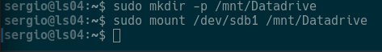

**Crear la estructura de carpetas:**

```bash
sudo mkdir -p /mnt/Datadrive/shares/Finance
sudo mkdir -p /mnt/Datadrive/shares/HRdosc
sudo mkdir -p /mnt/Datadrive/shares/Public
```

**Mover los contenidos de /srv/samba > /mnt/Datadrive/shares/:**

```bash
sudo mv /srv/samba/* /mnt/Datadrive/shares/
```

**Configurar el archivo `sudo nano /etc/fstab` > agregar al final de todo:**

```
LABEL=Datadrive /mnt/Datadrive ext4 defaults 0 2
```


**Actualizar `sudo nano /etc/samba/smb.conf`** ya que las carpetas están en un nuevo disco:

```ini
[Finance]
    path = /mnt/Datadrive/shares/Finance
    read only = No

[HRdocs]
    path = /mnt/Datadrive/shares/HRdosc
    read only = No

[Public]
    path = /mnt/Datadrive/shares/Public
    read only = No
```


**Reiniciar samba:**
```bash
sudo systemctl restart samba-ad-dc
```

**Comprobar con cualquiera de los usuarios:**


---

## Crear Tarea Programada (Backup)

```bash
sudo nano /root/backup.sh
```

Agregar el siguiente contenido:

```bash
#!/bin/bash
fecha=$(date +%Y-%m-%d)
echo "Iniciando backup de Finance el $fecha..." >> /var/log/backup_laboratorio.log
tar -czf /mnt/Datadrive/backup_finance_$fecha.tar.gz /mnt/Datadrive/shares/Finance
echo "Backup completado exitosamente." >> /var/log/backup_laboratorio.log
```

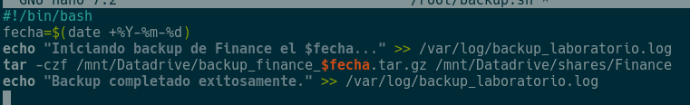

Dar los permisos de ejecución al script. Programar la tarea 7pm diariamente:

```bash
sudo crontab -e
```

Primero le das enter y añadir al final de todo:

```
0 19 * * * /root/backup.sh
```

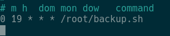

---

## Seguridad y Auditoría básica

Para generar un evento de auditoría en los logs de Samba:

**Habilitar en el servidor:** Revisa que en `smb.conf` la carpeta `[Finance]` tenga:

```ini
vfs objects = full_audit
```

Tienes que poner otra vez los permisos por si acaso, pero con la nueva ruta:

```bash
sudo setfacl -m 'g:LAB04\it_admins:rwx' /mnt/Datadrive/shares/Finance
```


Luego intentar entrar con Alice a la carpeta Finance e intentar crear/borrar y luego en el servidor comprobar el visor de tareas.

---

## Lo del tren:

**Instalas:**

```bash
sudo apt update
sudo apt install sl
```

**Para iniciar el tren es con (en el server):**

```bash
sl
```


---

## RECUERDA: Poner el ssh en el cliente.

**Instalar:**

```bash
sudo apt update
sudo apt install openssh-server
```

**Para entrar:**

```bash
ssh sergio@172.30.20.39
```

**En el Cliente: Abre dos terminales.**

En una pones:

```bash
ps aux
```

Y en la otra para parar:

```bash
kill -19 <número de ps aux>
```

Y para reanudar es:

```bash
kill -18 <número de ps aux>
```

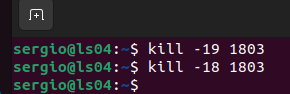

---

## Creación de la Relación de Confianza (Trust)

Usaremos el comando `samba-tool` para crear una confianza de bosque bidireccional. Este comando se ejecuta en **LS04**.

```bash
sudo apt update

sudo apt install -y acl attr samba samba-dsdb-modules samba-vfs-modules smbclient winbind libpam-winbind libnss-winbind libpam-krb5 krb5-config krb5-user dnsutils chrony net-tools

```

Ingresar la contraseña del otro dominio:


---

## Pruebas de Validación

Una vez creada la confianza, debemos comprobar que los dominios "confían" el uno en el otro.

**En ls04 comprobar:**

```bash
sudo samba-tool domain trust list
```


**y en ls2044:**


**Prueba de resolución cruzada (nslookup) en ambos servidores:**


**Verificar resolución de usuarios remotos (Winbind):**

```bash
sudo samba-tool user list -H ldap://lab2044.lan -U Administrator
```


```bash
sudo samba-tool user list -H ldap://lab04.lan -U Administrator
```


---

## Para unir un cliente al otro Dominio.

Por si acaso haz esto en el server principal:

```bash
sudo iptables -t nat -A POSTROUTING -o enp0s3 -j MASQUERADE
```

**En el Cliente:** Primero:

```bash
sudo nano /etc/hosts
```

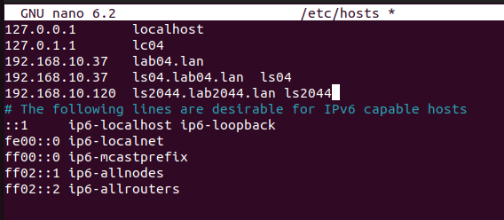

**Haz un backup:**

```bash
sudo mv /etc/resolv.conf /etc/resolv.conf.backup
```

**Después pones esto:**

```bash
sudo nano /etc/resolv.conf
```

```
nameserver 192.168.10.120
nameserver 192.168.10.37
```


**Cierra sesión y haz esto: En el segundo server crea clientes.**

```bash
sudo samba-tool user create paco
```


**Para comprobar los clientes que tienes en el server dos:**

```bash
wbinfo -u
```


**En el server primero:**


**Y ahora en el cliente cierras sesión: Inicias con un cliente del server dos.**


---

# Preparar servidor para Samba AD AWS

**Configurar el hostname y la IP fija:**

```bash
sudo hostnamectl set-hostname ls204
```

Luego dentro de:

```bash
sudo nano /etc/hosts
```

```bash
su reboot
```

**Con los siguientes comandos instalar samba:**

```bash
sudo apt update
sudo apt install -y acl attr samba samba-dsdb-modules samba-vfs-modules \
  smbclient winbind libpam-winbind libnss-winbind libpam-krb5 krb5-config \
  krb5-user dnsutils chrony net-tools
```

Durante la instalación pedirá el dominio de servidores para kerberos, poner el dominio:


---

## Deshabilitar servicios Samba clásicos

```bash
sudo systemctl stop smbd nmbd winbind
sudo systemctl disable smbd nmbd winbind
```


El servidor solo necesita samba ad-dc para funcionar como Active Directory:

```bash
sudo systemctl unmask samba-ad-dc
sudo systemctl enable samba-ad-dc
```

Crear una copia de seguridad del archivo `/etc/samba/smb.conf`:

```bash
sudo mv /etc/samba/smb.conf /etc/samba/smb.conf.bak
```

---

# FASE 5 — Provisionar el AD Samba

## Ejecutar provisionado

```bash
sudo samba-tool domain provision
```

Luego crear copia de seguridad de la configuración predeterminada de kerberos:

```bash
sudo mv /etc/krb5.conf /etc/krb5.conf.orig
```

Reemplazar con el archivo `/var/lib/samba/krb5.conf`:

```bash
sudo cp /var/lib/samba/private/krb5.conf /etc/krb5.conf
```

No edite nada lo deje porque ya estaba configurado:

```bash
sudo nano /etc/krb5.conf
```

---

# FASE 6 - Activar el controlador de dominio

**Iniciar servicio samba Active Directory samba-ad-dc:**

```bash
sudo systemctl start samba-ad-dc
```

**Comprobar servicios:**

```bash
sudo systemctl status samba-ad-dc
```


**Antes debo deshabilitar el archivo resolved:**

```bash
sudo systemctl disable --now systemd-resolved
sudo unlink /etc/resolv.conf
```

Crear un nuevo fichero resolv.conf:

```bash
sudo nano /etc/resolv.conf
```

```
nameserver 172.31.31.175
nameserver 8.8.8.8
search lab04.lan
```


Ahora hacemos inmutable el archivo `/etc/resolv.conf` para que no pueda cambiar:

```bash
sudo chattr +i /etc/resolv.conf
```

---

# FASE 7 — Validación Final

**Comprobar autenticación en el servidor de kerberos mediante el administrador:**

```bash
kinit administrator@LAB04.LAN
klist
```


