<div align="center">

# Creación del nuevo Linux Server

**Samba Active Directory — Documentación completa de instalación y configuración**

</div>

---

## Índice

- [Configuración de Red (Netplan)](#configuración-de-red-netplan)
- [Hostname e IP Fija](#hostname-e-ip-fija)
- [Instalación SSH](#instalación-ssh)
- [Configuración /etc/hosts](#configuración-etchosts)
- [Preparación para Samba](#preparación-para-samba)
- [Instalación de Samba](#instalación-de-samba)
- [Deshabilitar Servicios Samba Clásicos](#deshabilitar-servicios-samba-clásicos)
- [Provisionar el AD Samba](#provisionar-el-ad-samba)
- [Activar el Controlador de Dominio](#activar-el-controlador-de-dominio)
- [Configuración Chrony NTP](#configuración-chrony-ntp)
- [Verificación de Nombres de Dominio](#verificación-de-nombres-de-dominio)
- [Cliente Linux](#cliente-linux)
- [Gestión de Usuarios, Grupos y GPO](#gestión-de-usuarios-grupos-y-gpo)
- [Sprint 3 — Creación y Compartición de Carpetas](#sprint-3--creación-y-compartición-de-carpetas)
- [Preparación del Disco](#preparación-del-disco)
- [Tarea Programada — Backup](#tarea-programada--backup)
- [Seguridad y Auditoría Básica](#seguridad-y-auditoría-básica)
- [Lo del Tren](#lo-del-tren)
- [Relación de Confianza (Trust)](#relación-de-confianza-trust)
- [Preparar Servidor Samba AD en AWS](#preparar-servidor-samba-ad-en-aws)

---

## <span style="color:#e74c3c">Configuración de Red (Netplan)</span>

Configurar el archivo de red:

```bash
sudo nano /etc/netplan/50-cloud-init.yaml
```

```yaml
network:
  version: 2
  renderer: networkd
  ethernets:
    enp0s3:
      addresses:
        - 172.30.20.120/16
      routes:
        - to: default
          via: 172.30.20.1
      nameservers:
        addresses:
          - 10.239.3.7
          - 10.239.3.8
    enp0s8:
      addresses:
        - 192.168.10.120/24
```

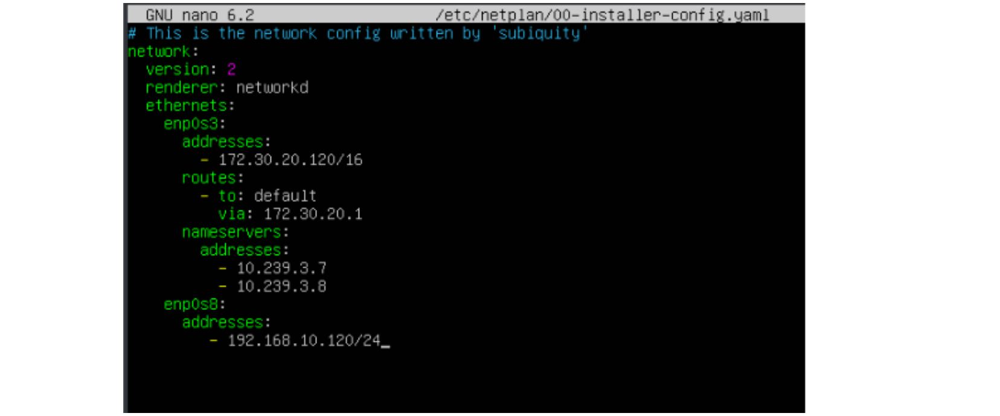

Reiniciar la red:

```bash
sudo netplan apply
```

---

## <span style="color:#e74c3c">Hostname e IP Fija</span>

```bash
sudo hostnamectl set-hostname ls204
```

Reiniciar el sistema:

```bash
reboot
```

---

## <span style="color:#9b59b6">Instalación SSH</span>

```bash
sudo apt install openssh-server
ssh sergio@172.30.20.120
```

---

## <span style="color:#9b59b6">Configuración /etc/hosts</span>

```bash
sudo nano /etc/hosts
```

```
127.0.0.1       localhost
127.0.0.1       ls2044
192.168.10.120  ls2044.lab2044.lan  ls2044
```


Verificar haciendo ping al nombre `ls2044` — debe responder automáticamente:

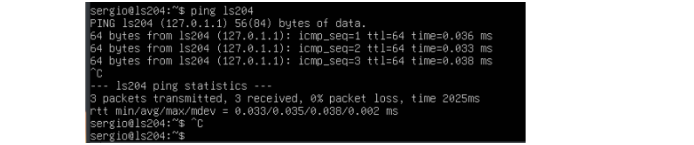

---

## <span style="color:#e74c3c">Preparación para Samba</span>

Deshabilitar `systemd-resolved`, que es incompatible con Samba:

```bash
sudo systemctl disable --now systemd-resolved
```

Eliminar el enlace simbólico para que los cambios se hagan en el archivo real:

```bash
sudo unlink /etc/resolv.conf
```

Crear un nuevo `resolv.conf`:

```bash
sudo nano /etc/resolv.conf
```

```
nameserver 192.168.10.15
nameserver 10.239.3.7
search lab15.lan
```


Hacer el archivo inmutable:

```bash
sudo chattr +i /etc/resolv.conf
```

---

## <span style="color:#9b59b6">Instalación de Samba</span>

```bash
sudo apt update
sudo apt install -y acl attr samba samba-dsdb-modules samba-vfs-modules \
  smbclient winbind libpam-winbind libnss-winbind libpam-krb5 krb5-config \
  krb5-user dnsutils chrony net-tools
```

**Durante la instalación pedirá la configuración de Kerberos:**

Dominio principal (realm):

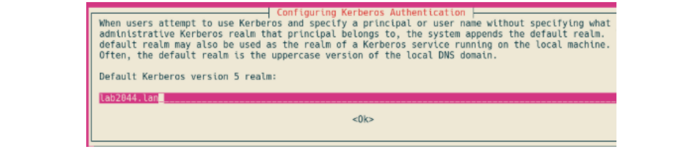

Servidor Kerberos del realm:


Servidor administrativo:


---

## <span style="color:#e74c3c">Deshabilitar Servicios Samba Clásicos</span>

Detener y deshabilitar los servicios de Active Directory que no se van a usar:

```bash
sudo systemctl stop smbd nmbd winbind
sudo systemctl disable smbd nmbd winbind
```

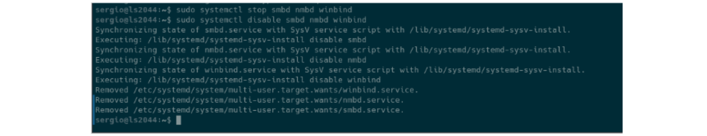

El servidor solo necesita `samba-ad-dc` para funcionar como Active Directory:

```bash
sudo systemctl unmask samba-ad-dc
sudo systemctl enable samba-ad-dc
```

Crear copia de seguridad del archivo de configuración:

```bash
sudo mv /etc/samba/smb.conf /etc/samba/smb.conf.bak
```

---

## <span style="color:#9b59b6">Provisionar el AD Samba</span>

Ejecutar el provisionado:

```bash
sudo samba-tool domain provision
```

> Cuando pida el DNS forwarder usar: `10.239.3.7`


### Configurar Kerberos

```bash
# Crear copia de seguridad
sudo mv /etc/krb5.conf /etc/krb5.conf.orig

# Reemplazar con el archivo generado por Samba
sudo cp /var/lib/samba/private/krb5.conf /etc/krb5.conf
```

No editar el archivo — ya estaba correctamente configurado:

```bash
sudo nano /etc/krb5.conf
```

---

## <span style="color:#e74c3c">Activar el Controlador de Dominio</span>

Iniciar el servicio Samba AD DC:

```bash
sudo systemctl start samba-ad-dc
```

Comprobar el estado del servicio:

```bash
sudo systemctl status samba-ad-dc
```

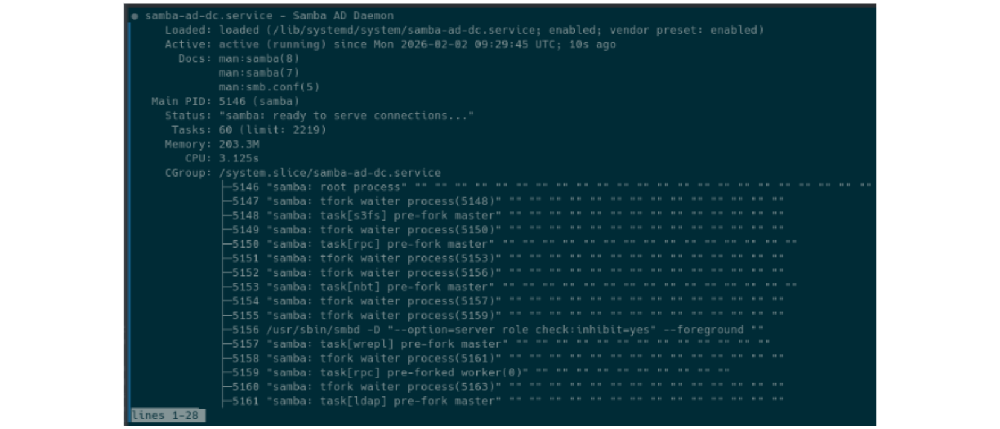

Cambiar permisos del directorio NTP:

```bash
sudo chown root:_chrony /var/lib/samba/ntp_signd
sudo chmod 750 /var/lib/samba/ntp_signd
```


---

## <span style="color:#9b59b6">Configuración Chrony NTP</span>

```bash
sudo nano /etc/chrony/chrony.conf
```

Añadir al final del archivo:

```
bindcmdaddress 192.168.10.37
allow 192.168.10.0/24
ntpsigndsocket /var/lib/samba/ntp_signd
```


Reiniciar y verificar:

```bash
sudo systemctl restart chronyd
sudo systemctl status chronyd
```


---

## <span style="color:#e74c3c">Verificación de Nombres de Dominio</span>

```bash
host -t A lab04.lan
host -t A ls04.lab04.lan
```

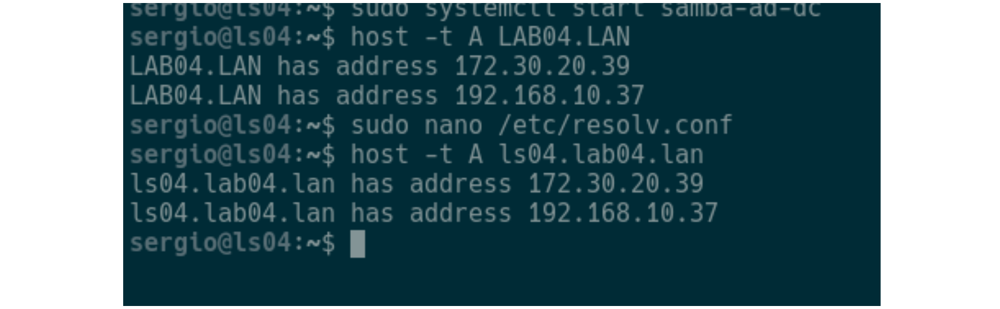

```bash
host -t SRV _kerberos._udp.lab04.lan
host -t SRV _ldap._tcp.lab04.lan
```


```bash
smbclient -L lab04.lan -N
```


### Validación Final — Kerberos

```bash
kinit administrator@LAB2044.LAN
klist
```


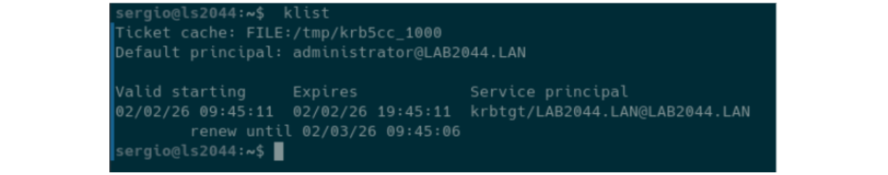

---

## <span style="color:#9b59b6">Cliente Linux</span>

### Configurar hostname

```bash
sudo hostnamectl set-hostname lc04
```

### Configurar red en modo manual (IPv4)

| Campo | Valor |
|---|---|
| Dirección | `192.168.10.38` |
| Máscara de red | `255.255.255.0` |
| DNS | `192.168.10.37` |

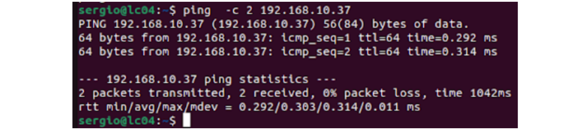

### Comprobar conectividad con ping

```bash
# Desde el cliente al servidor
ping -c 2 192.168.10.37

# Desde el servidor al cliente
ping -c 2 192.168.10.38
```

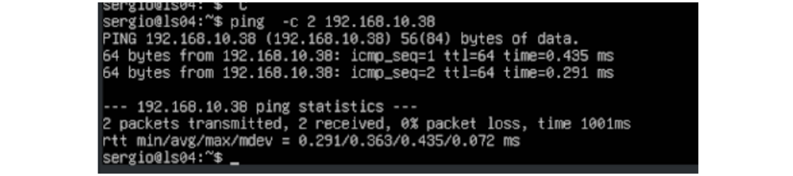

### Configurar /etc/hosts en el cliente

```bash
sudo nano /etc/hosts
```

```
127.0.0.1       localhost
127.0.0.1       lc04
192.168.10.37   lab04.lan
192.168.10.37   ls04.lab04.lan   ls04
```


Verificación:

```bash
ping -c2 ls04
```

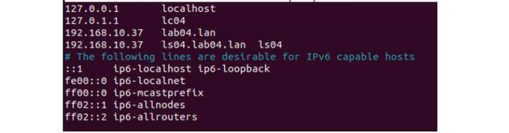

### Configurar Netplan — comprobar rutas

```bash
sudo su
ip route
```

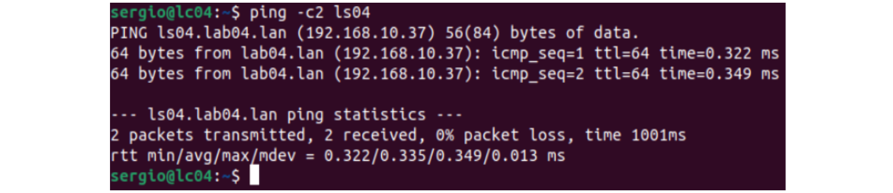

---

### <span style="color:#e74c3c">Conectividad a Internet (si falla)</span>

Verificar que el servidor tenga activado el reenvío IP:

```bash
sudo nano /etc/sysctl.conf
```

Añadir al final:

```
net.ipv4.ip_forward=1
```

Aplicar y comprobar:

```bash
sudo sysctl -p
sysctl net.ipv4.ip_forward
```

Configurar NAT en el servidor:

```bash
sudo iptables -t nat -A POSTROUTING -o enp0s3 -j MASQUERADE
sudo iptables -t nat -L -n -v
```

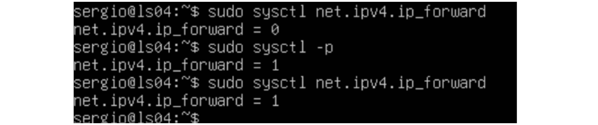

---

### <span style="color:#9b59b6">Instalar paquetes en el cliente</span>

Instalar NTPDATE **(en el cliente)**, estar en root:

```bash
sudo su
sudo apt update
sudo apt-get install ntpdate
sudo ntpdate -q lab04.lan
sudo ntpdate lab15.lan
```

### Instalar Samba y Kerberos en el cliente

```bash
sudo apt update
sudo apt-get install samba krb5-config krb5-user winbind libpam-winbind libnss-winbind
```

> Si da fallo:
> ```bash
> sudo systemctl stop unattended-upgrades
> sudo kill -9 <PID>
> sudo dpkg --configure -a
> ```


```bash
kinit administrator@LAB04.LAN
klist
```

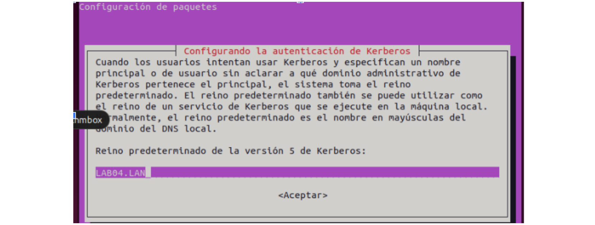

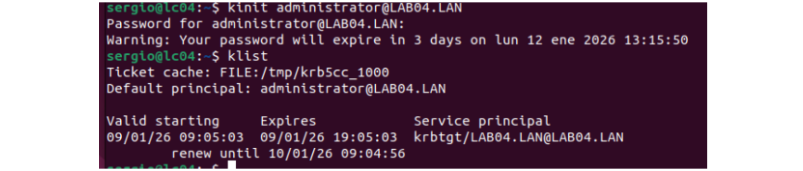

### Configurar smb.conf en el cliente

```bash
sudo mv /etc/samba/smb.conf /etc/samba/smb.conf.initial
sudo nano /etc/samba/smb.conf
```

```ini
[global]
    workgroup = LAB04
    realm = LAB04.LAN
    netbios name = lc04
    security = ADS
    dns forwarder = 192.168.10.37

idmap config * : backend = tdb
idmap config *:range = 50000-1000000

    template homedir = /home/%D/%U
    template shell = /bin/bash
    winbind use default domain = true
    winbind offline logon = false
    winbind nss info = rfc2307
    winbind enum users = yes
    winbind enum groups = yes

    vfs objects = acl_xattr
    map acl inherit = Yes
    store dos attributes = Yes
```

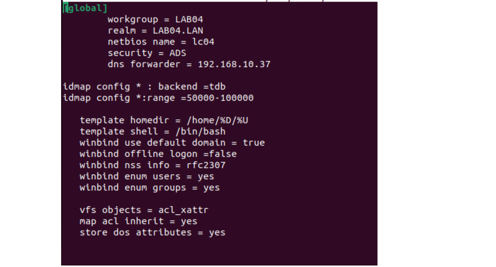

### Gestionar servicios Samba en el cliente

```bash
# Reiniciar demonios
sudo systemctl restart smbd nmbd

# Detener — el cliente NO es controlador de dominio
sudo systemctl stop samba-ad-dc

# Habilitar los servicios necesarios
sudo systemctl enable smbd nmbd
```


### Unir Ubuntu Desktop al dominio

```bash
sudo net ads join -U administrator
```


### Verificar desde el servidor

```bash
sudo su
sudo samba-tool computer list
```


---

### <span style="color:#e74c3c">Configurar Autenticación AD en el cliente</span>

```bash
sudo nano /etc/nsswitch.conf
```

Modificar las líneas:

```
passwd:   files winbind
group:    files winbind
shadow:   files winbind
hosts:    files dns
```

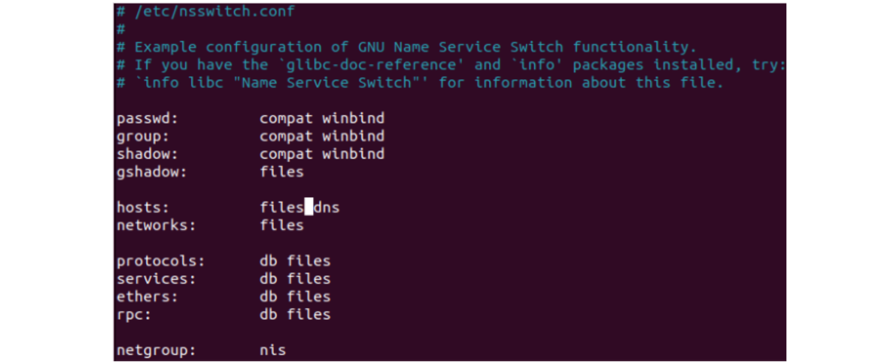

Reiniciar winbind:

```bash
sudo systemctl restart winbind
```

Listar usuarios y grupos del dominio:

```bash
wbinfo -u
wbinfo -g
```

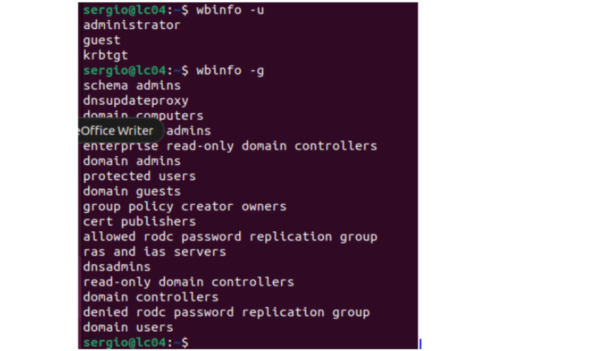

### Configurar PAM para directorio home automático

```bash
sudo pam-auth-update
```

Marcar: **Create home directory on login**

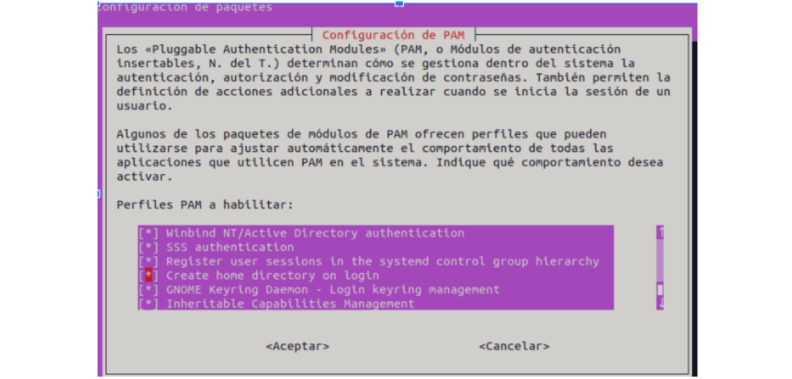

```bash
sudo nano /etc/pam.d/common-account
```

Añadir al final:

```
session required pam_mkhomedir.so skel=/etc/skel/ umask=0022
```


### Añadir administrator al grupo sudo

```bash
sudo usermod -aG sudo administrator
```


### Iniciar sesión con cuenta de dominio

Cerrar sesión y entrar con `administrator@lab04.lan`:

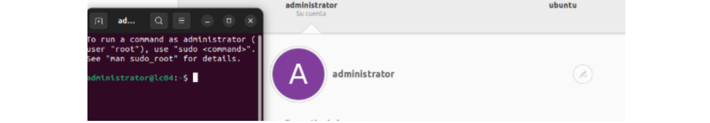

---

## <span style="color:#e74c3c">Gestión de Usuarios, Grupos y GPO</span>

> Todos los comandos se ejecutan **en el servidor Samba**

### Crear Grupos

```bash
sudo samba-tool group add IT_departaments --group-scope=Universal --group-type=Security
sudo samba-tool group add IT_admins --group-scope=Universal --group-type=Security
sudo samba-tool group add Students --group-scope=Universal --group-type=Security
```

> El scope puede ser: `global`, `domain`, `Universal`

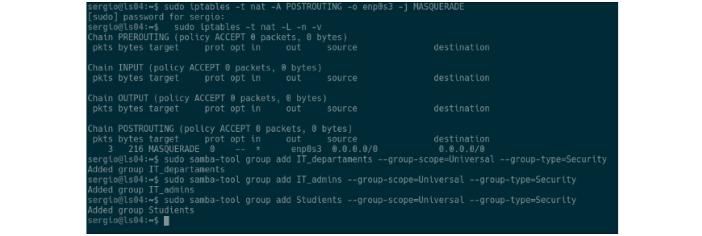

### Crear Usuarios

```bash
sudo samba-tool user create alice
sudo samba-tool user create bob
sudo samba-tool user create charlie
```


### Añadir Usuarios a Grupos

```bash
sudo samba-tool group addmembers IT_admins Alice
sudo samba-tool group addmembers Students charlie
sudo samba-tool group addmembers Students bob
```


### Crear Unidades Organizativas

```bash
sudo samba-tool ou create "OU=IT_departaments,DC=lab04,DC=lan"
sudo samba-tool ou create "OU=HR_Department,DC=lab04,DC=lan"
sudo samba-tool ou create "OU=Students,DC=lab04,DC=lan"
```

### Mover Usuarios y Grupos a sus OUs

**Usuarios:**

```bash
sudo samba-tool user move alice "OU=IT_departaments,DC=lab04,DC=lan"
sudo samba-tool user move bob "OU=Students,DC=lab04,DC=lan"
sudo samba-tool user move charlie "OU=HR_Department,DC=lab04,DC=lan"
```

**Grupos:**

```bash
sudo samba-tool group move IT_admins "OU=IT_departaments,DC=lab04,DC=lan"
sudo samba-tool group move Studients "OU=Students,DC=lab04,DC=lan"
sudo samba-tool group move IT_departaments "OU=HR_Department,DC=lab04,DC=lan"
```


### Verificar

```bash
sudo samba-tool ou list
```


---

### <span style="color:#9b59b6">Crear la GPO</span>

```bash
sudo samba-tool gpo create "IT_Security_Policy" -U Administrator
```


### Crear PSO (Password Settings Object)

```bash
sudo samba-tool domain passwordsettings pso create "PSO_IT_Estricta" 10 \
  --account-lockout-threshold=3 \
  --account-lockout-duration=5 \
  --reset-account-lockout-after=5 \
  -U Administrator
```

> Define **3 intentos** de login y **5 minutos** de bloqueo.


### Aplicar PSO al Grupo

```bash
sudo samba-tool domain passwordsettings pso apply "PSO_IT_Estricta" "it_admins" \
  -U Administrator
```

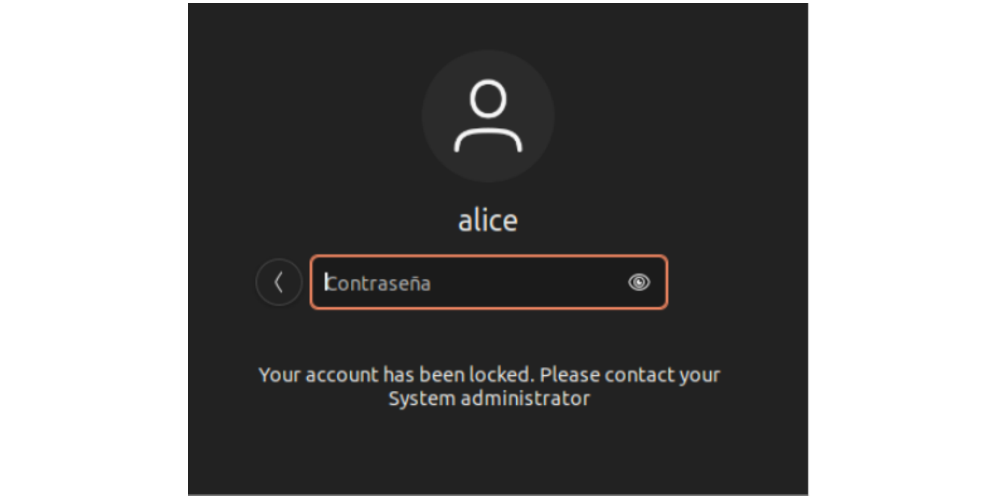

---

## <span style="color:#e74c3c">Sprint 3 — Creación y Compartición de Carpetas</span>

### 1. Crear carpetas en el servidor

```bash
sudo mkdir -p /srv/samba/Finance
sudo mkdir -p /srv/samba/HRdosc
sudo mkdir -p /srv/samba/Public
```


### 2. Configurar Samba

```bash
sudo nano /etc/samba/smb.conf
```

Añadir al final:

```ini
[Finance]
    path = /srv/samba/Finance
    read only = No

[HRdocs]
    path = /srv/samba/HRdosc
    read only = No

[Public]
    path = /srv/samba/Public
    read only = No
```

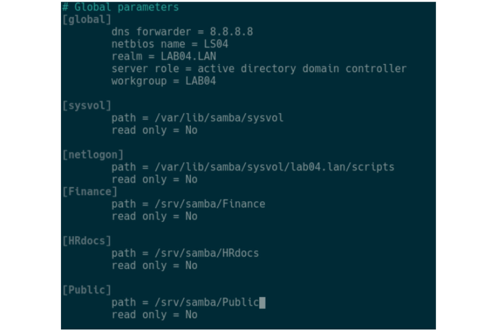

Reiniciar Samba:

```bash
sudo systemctl restart smbd
```

---

### 3. Aplicar Permisos ACL

```bash
sudo apt update && sudo apt install acl -y
```

#### Forzar la vinculación de librerías NSS

```bash
sudo ln -sf /lib/x86_64-linux-gnu/libnss_winbind.so.2 \
            /lib/x86_64-linux-gnu/libnss_winbind.so
sudo ldconfig
```


#### Limpiar caché y reiniciar completamente

```bash
sudo systemctl stop samba-ad-dc
sudo net cache flush
sudo rm -f /var/lib/samba/*.tdb
sudo rm -f /var/lib/samba/group_mapping.tdb
sudo systemctl start samba-ad-dc
```


> Si `getent` sigue fallando, instalar las librerías:
> ```bash
> sudo apt update
> sudo apt install libnss-winbind libpam-winbind
> sudo systemctl restart winbind
> sudo systemctl restart smbd nmbd
> ```

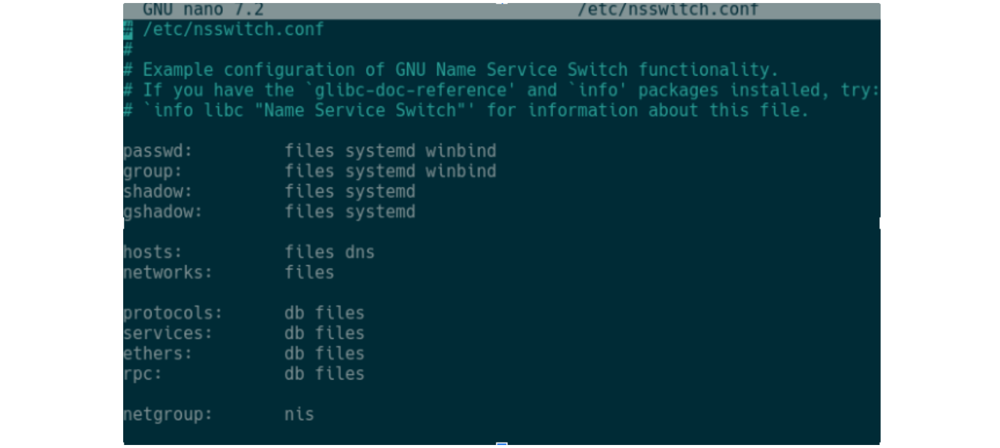

#### Verificar que los grupos AD se resuelven

```bash
getent group "LAB04\it_admins"
```


#### Asignar permisos con setfacl

**IT_admins (Alice) — Acceso Total a todo:**

```bash
sudo setfacl -m 'g:LAB04\it_admins:rwx' /srv/samba/Finance
sudo setfacl -m g:it_admins:rwx /srv/samba/HRdosc
sudo setfacl -m g:it_admins:rwx /srv/samba/Public
```


**Students (Bob) — Acceso restringido:**

```bash
# En Public: Lectura y Escritura
sudo setfacl -m g:studients:rwx /srv/samba/Public

# En Finance y HRdocs: Solo Lectura
sudo setfacl -m g:studients:rx /srv/samba/Finance
sudo setfacl -m g:studients:rx /srv/samba/HRdosc
```

**IT_departaments (Charlie) — Acceso selectivo:**

```bash
# En HRdocs: Lectura y Escritura
sudo setfacl -m g:it_departaments:rwx /srv/samba/HRdosc

# En Public: Lectura y Escritura
sudo setfacl -m g:it_departaments:rwx /srv/samba/Public

# En Finance: Sin acceso
sudo setfacl -m g:it_departaments:--- /srv/samba/Finance
```


#### Tabla resumen de permisos

| Carpeta | IT_admins (Alice) | Students (Bob) | IT_departaments (Charlie) |
|---|:---:|:---:|:---:|
| **Finance** | `rwx` | `rx` | `---` |
| **HRdocs** | `rwx` | `rx` | `rwx` |
| **Public** | `rwx` | `rwx` | `rwx` |

---

## <span style="color:#9b59b6">Preparación del Disco</span>

Agregar un disco de 10 GB e identificarlo:

```bash
lsblk
```


### Crear tabla de particiones GPT

```bash
sudo parted /dev/sdb mklabel gpt
sudo parted /dev/sdb mkpart primary ext4 0% 100%
```


### Formatear con EXT4

> En Linux usamos **EXT4** como estándar nativo. Samba lo presentará a los clientes como NTFS.

```bash
sudo mkfs.ext4 -L Datadrive /dev/sdb1
```

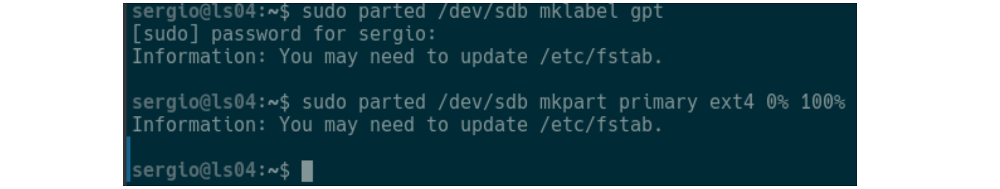

### Montar el disco y crear estructura de carpetas

```bash
sudo mkdir -p /mnt/Datadrive
sudo mount /dev/sdb1 /mnt/Datadrive
```

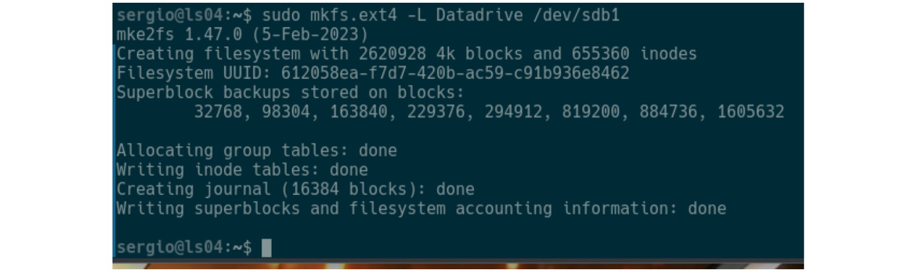

```bash
sudo mkdir -p /mnt/Datadrive/shares/Finance
sudo mkdir -p /mnt/Datadrive/shares/HRdosc
sudo mkdir -p /mnt/Datadrive/shares/Public

# Mover contenidos del disco anterior
sudo mv /srv/samba/* /mnt/Datadrive/shares/
```

### Configurar montaje automático en /etc/fstab

```bash
sudo nano /etc/fstab
```

Añadir al final:

```
LABEL=Datadrive /mnt/Datadrive ext4 defaults 0 2
```

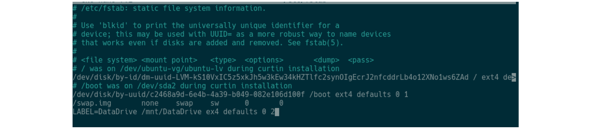

### Actualizar smb.conf con las nuevas rutas

```bash
sudo nano /etc/samba/smb.conf
```

```ini
[Finance]
    path = /mnt/Datadrive/shares/Finance
    read only = No

[HRdocs]
    path = /mnt/Datadrive/shares/HRdosc
    read only = No

[Public]
    path = /mnt/Datadrive/shares/Public
    read only = No
```


Reiniciar Samba:

```bash
sudo systemctl restart samba-ad-dc
```

---

## <span style="color:#e74c3c">Tarea Programada — Backup</span>

### Crear el script de backup

```bash
sudo nano /root/backup.sh
```

```bash
#!/bin/bash
fecha=$(date +%Y-%m-%d)
echo "Iniciando backup de Finance el $fecha..." >> /var/log/backup_laboratorio.log
tar -czf /mnt/Datadrive/backup_finance_$fecha.tar.gz /mnt/Datadrive/shares/Finance
echo "Backup completado exitosamente." >> /var/log/backup_laboratorio.log
```

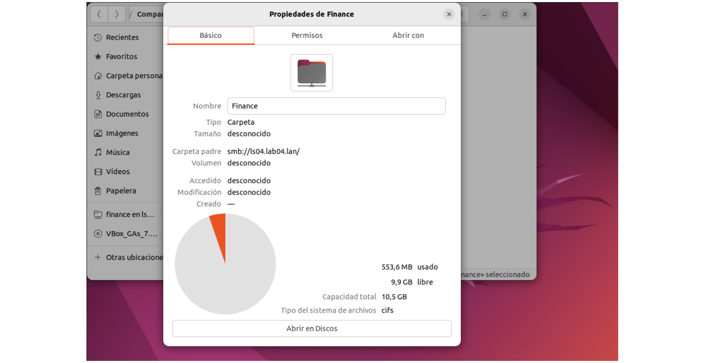

### Dar permisos de ejecución y programar

```bash
chmod +x /root/backup.sh
sudo crontab -e
```

Añadir al final:

```
0 19 * * * /root/backup.sh
```


---

## <span style="color:#9b59b6">Seguridad y Auditoría Básica</span>

Habilitar auditoría en la carpeta Finance añadiendo en `smb.conf`:

```bash
sudo nano /etc/samba/smb.conf
```

```ini
[Finance]
    path = /mnt/Datadrive/shares/Finance
    read only = No
    vfs objects = full_audit
```


Volver a aplicar permisos con la nueva ruta:

```bash
sudo setfacl -m 'g:LAB04\it_admins:rwx' /mnt/Datadrive/shares/Finance
```

---

## <span style="color:#e74c3c">Lo del Tren</span>

### Instalar y ejecutar en el servidor

```bash
sudo apt update
sudo apt install sl
sl
```


### Controlar el proceso desde el cliente vía SSH

Instalar SSH en el cliente:

```bash
sudo apt update
sudo apt install openssh-server
ssh sergio@172.30.20.39
```

Abrir **dos terminales**:

- **Terminal 1:** `ps aux` para ver el PID del proceso `sl`
- **Terminal 2:** controlar el proceso

```bash
# Pausar el tren
kill -19 <PID>

# Reanudar el tren
kill -18 <PID>
```

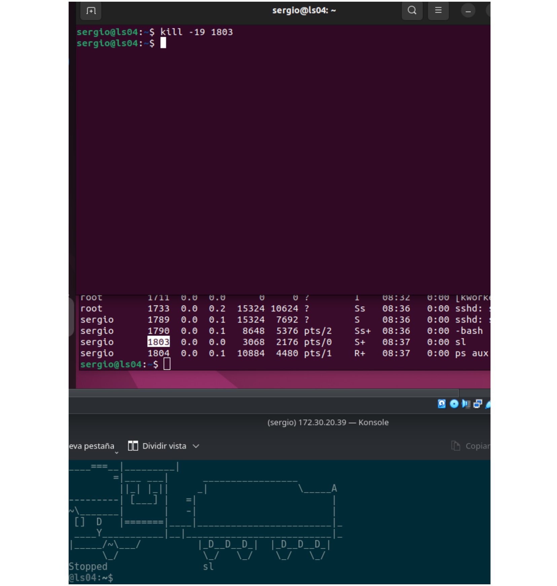

---

## <span style="color:#9b59b6">Relación de Confianza (Trust)</span>

### Paso 1 — Configurar smb.conf

```bash
sudo nano /etc/samba/smb.conf
```

```ini
[global]
    dns forwarder = 10.239.3.7 192.168.10.16
    netbios name = LS4
    realm = LAB4.LAN
    server role = active directory domain controller
    workgroup = LAB4

winbind enum users = yes
winbind enum groups = yes
winbind use default domain = yes
idmap_ldb:use xid = yes
```


### Paso 2 — Configurar /etc/hosts

```bash
sudo nano /etc/hosts
```

```
127.0.0.1       localhost
127.0.0.1       admin
192.168.10.117  ls4.lab4.lan    ls4
192.168.10.120  ls2044.lab2044.lan  ls2044
```

### Paso 3 — Configurar resolv.conf

```bash
sudo chattr -i /etc/resolv.conf
sudo nano /etc/resolv.conf
```

```
nameserver 192.168.10.120
nameserver 192.168.10.117
nameserver 10.239.3.7
search lab4.lan
```

```bash
sudo chattr +i /etc/resolv.conf
```

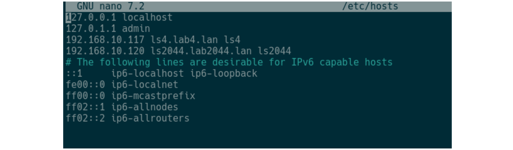


### Paso 4 — Reiniciar servicios

```bash
sudo systemctl restart samba-ad-dc
sudo timedatectl set-ntp true
```

### Paso 5 — Crear la confianza de bosque bidireccional

> Este comando se ejecuta en **LS04**:

```bash
sudo samba-tool domain trust create lab2044.lan \
  --type=forest \
  --direction=both \
  --create-location=both \
  --user=Administrator@lab2044.lan
```


### Pruebas de Validación

```bash
# En ls04
sudo samba-tool domain trust list

# En ls2044
sudo samba-tool domain trust list
```


Resolución cruzada con nslookup:

```bash
nslookup lab2044.lan   # desde ls04
nslookup lab04.lan     # desde ls2044
```

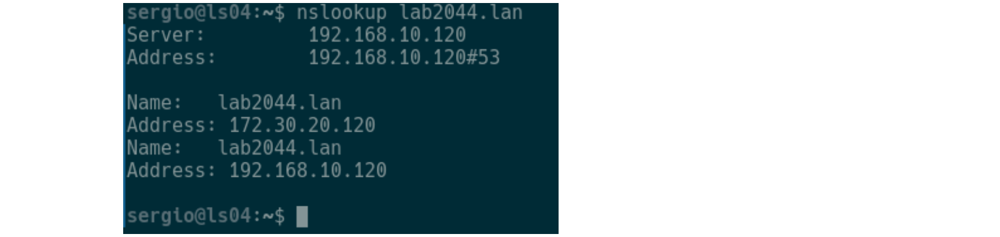


Verificar usuarios remotos vía LDAP:

```bash
sudo samba-tool user list -H ldap://lab2044.lan -U Administrator
sudo samba-tool user list -H ldap://lab04.lan -U Administrator
```


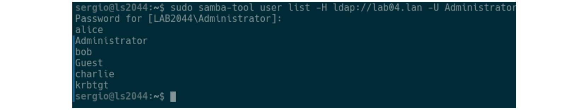

### Unir el cliente al otro dominio

En el servidor principal:

```bash
sudo iptables -t nat -A POSTROUTING -o enp0s3 -j MASQUERADE
```

En el cliente, editar hosts y resolv.conf apuntando a ambos servidores:

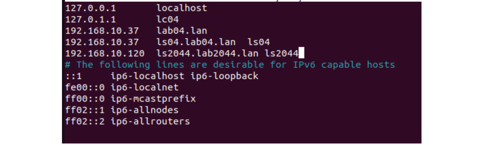

```bash
sudo mv /etc/resolv.conf /etc/resolv.conf.backup
sudo nano /etc/resolv.conf
```

```
nameserver 192.168.10.120
nameserver 192.168.10.37
```


En el segundo servidor, crear usuarios:

```bash
sudo samba-tool user create paco
sudo samba-tool user create hola
sudo samba-tool user create vegetta
```

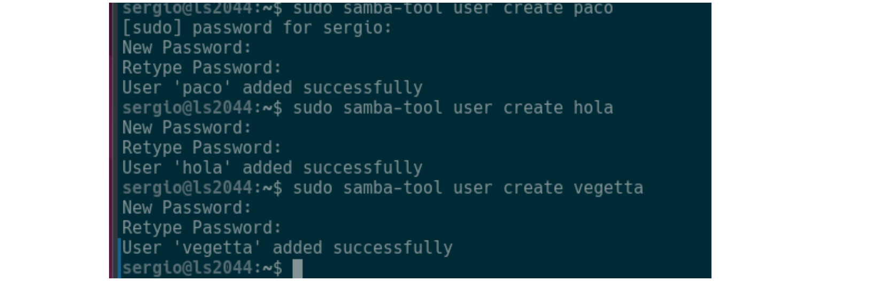

Comprobar usuarios de cada dominio:

```bash
wbinfo -u   # en ls2044
wbinfo -u   # en ls04
```

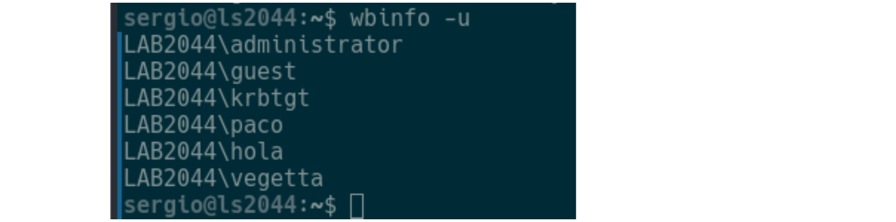

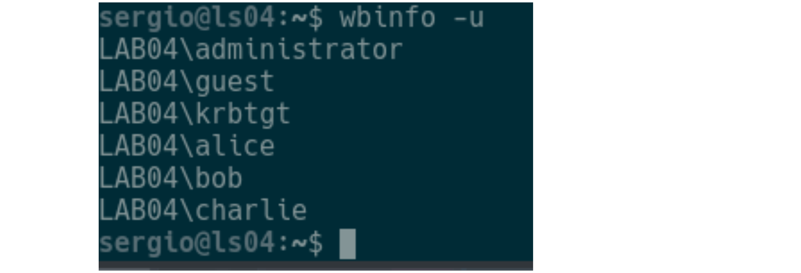

El cliente puede iniciar sesión con un usuario del segundo servidor:


---

## <span style="color:#e74c3c">Preparar Servidor Samba AD en AWS</span>

### Configurar hostname y /etc/hosts

```bash
sudo hostnamectl set-hostname ls204
sudo nano /etc/hosts
reboot
```

### Instalar Samba

```bash
sudo apt update
sudo apt install -y acl attr samba samba-dsdb-modules samba-vfs-modules \
  smbclient winbind libpam-winbind libnss-winbind libpam-krb5 krb5-config \
  krb5-user dnsutils chrony net-tools
```

Configurar Kerberos durante la instalación:

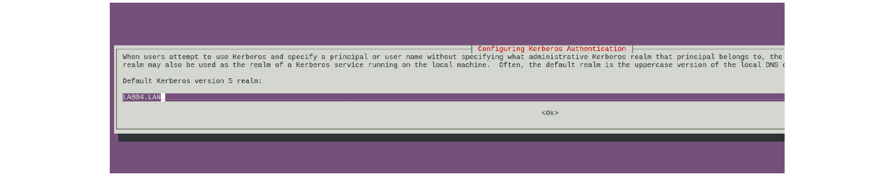

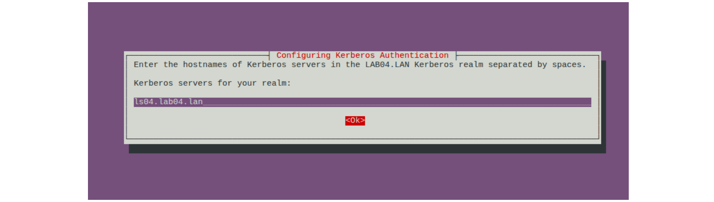


### Deshabilitar Servicios Samba Clásicos

```bash
sudo systemctl stop smbd nmbd winbind
sudo systemctl disable smbd nmbd winbind
sudo systemctl unmask samba-ad-dc
sudo systemctl enable samba-ad-dc
sudo mv /etc/samba/smb.conf /etc/samba/smb.conf.bak
```

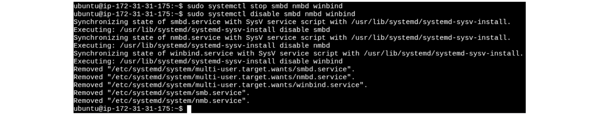

### FASE 5 — Provisionar el AD Samba

```bash
sudo samba-tool domain provision
sudo mv /etc/krb5.conf /etc/krb5.conf.orig
sudo cp /var/lib/samba/private/krb5.conf /etc/krb5.conf
sudo nano /etc/krb5.conf
```


### FASE 6 — Activar el Controlador de Dominio

```bash
sudo systemctl start samba-ad-dc
sudo systemctl status samba-ad-dc
```


Deshabilitar resolved y configurar resolv.conf:

```bash
sudo systemctl disable --now systemd-resolved
sudo unlink /etc/resolv.conf
sudo nano /etc/resolv.conf
```

```
nameserver 172.31.31.175
nameserver 8.8.8.8
search lab04.lan
```

```bash
sudo chattr +i /etc/resolv.conf
```

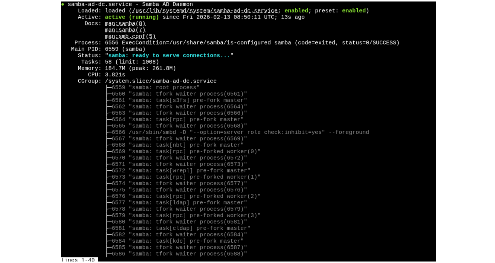

### FASE 7 — Validación Final

```bash
kinit administrator@LAB04.LAN
klist
```


---

<div align="center">

**Documentación del proceso completo de instalación y configuración de Samba Active Directory en Ubuntu Server**

</div>
