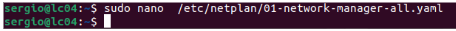

# Ubuntu Desktop Client joined to Samba Active Directory

This document describes how to configure an Ubuntu Desktop client, connect it to a Samba Active Directory Domain Controller, manage users and groups, and apply security policies.

## 1. Create Ubuntu Desktop Virtual Machine

Set the hostname of the client machine:
$ sudo hostnamectl set-hostname cli-ssd

## 2. Network Configuration (IPv4)

Configure the IPv4 network manually according to the lab diagram and verify connectivity:
$ ping <server-ip>
$ ping <client-ip>

## 3. Hosts File Configuration

Edit the hosts file to add server and domain resolution:
$ sudo nano /etc/hosts

## 4. Netplan Configuration

Switch to root and configure the network:
$ sudo su
$ nano /etc/netplan/01-network-manager-all.yaml
$ sudo netplan apply

If permission errors appear:
$ sudo chmod 600 /etc/netplan/01-network-manager-all.yaml
$ sudo chown root:root /etc/netplan/01-network-manager-all.yaml
$ sudo netplan apply

Verify routing:
$ ip route

## 5. Connectivity and Internet Test

Verify DNS and internet access:
$ ping lab04.lan
$ ping 8.8.8.8

## 6. Enable IP Forwarding on Server

Edit sysctl configuration:
$ sudo nano /etc/sysctl.conf

Add at the end:
net.ipv4.ip_forward=1

Apply and verify:
$ sudo sysctl -p
$ sysctl net.ipv4.ip_forward

## 7. Configure NAT on Server

Enable NAT so the client can access the internet:
$ sudo iptables -t nat -A POSTROUTING -o enp0s3 -j MASQUERADE
$ sudo iptables -t nat -L -n -v

## 8. Time Synchronization

Server configuration with Chrony:
$ sudo apt update
$ sudo apt install chrony -y
$ sudo nano /etc/chrony/chrony.conf

Modify:
allow 0

Restart and allow NTP:
$ sudo systemctl restart chrony
$ sudo ufw allow 123/udp

Client configuration:
$ sudo nano /etc/systemd/timesyncd.conf
$ sudo systemctl restart systemd-timesyncd
$ timedatectl show-timesync --all

Alternative synchronization method:
$ sudo apt install ntpdate
$ sudo ntpdate lab04.lan
$ sudo ntpdate -q lab04.lan

## 9. Install Required Packages on Ubuntu Desktop

Install required packages:
$ sudo apt update
$ sudo apt install samba krb5-config krb5-user winbind libpam-winbind libnss-winbind

If installation fails:
$ sudo systemctl stop unattended-upgrades
$ sudo kill -9 4363
$ sudo dpkg --configure -a
$ sudo apt install samba krb5-config krb5-user winbind libpam-winbind libnss-winbind

## 10. Kerberos Authentication Test

Test Kerberos authentication:
$ kinit administrator@LAB04.LAN
$ klist

## 11. Kerberos Configuration

Edit Kerberos configuration:
$ sudo nano /etc/krb5.conf

Add:
dns_lookup_realm = true
dns_lookup_kdc = true

## 12. Samba Configuration

Backup and recreate Samba configuration:
$ sudo mv /etc/samba/smb.conf /etc/samba/smb.conf.initial
$ sudo nano /etc/samba/smb.conf

Restart required services:
$ sudo systemctl restart smbd nmbd
$ sudo systemctl stop samba-ad-dc
$ sudo systemctl enable smbd nmbd

## 13. Join Ubuntu Desktop to Samba Active Directory

Join the domain:
$ sudo net ads join -U administrator

Verify on server:
$ sudo samba-tool computer list

## 14. Configure Authentication with Active Directory

Edit NSS configuration:
$ sudo nano /etc/nsswitch.conf

Restart Winbind and verify users:
$ sudo systemctl restart winbind
$ wbinfo -u
$ wbinfo -g
$ getent passwd | grep administrator
$ id administrator

## 15. PAM Configuration for Home Directory Creation

Enable automatic home directory creation:
$ sudo pam-auth-update

Edit PAM configuration:
$ sudo nano /etc/pam.d/common-account

Add at the end:
session required pam_mkhomedir.so skel=/etc/skel/ umask=0022

## 16. Grant Sudo Permissions to Domain Administrator

Add administrator to sudo group:
$ sudo usermod -aG sudo administrator

Login using:
administrator@lab04.lan

## 17. User and Group Management in Samba AD

Create group and users:
$ sudo samba-tool group add IT_departaments --group-scope=Universal --group-type=Security
$ sudo samba-tool user create alice
$ sudo samba-tool group addmembers IT_admins alice

## 18. Organizational Units (OU)

Create OU:
$ sudo samba-tool ou create "OU=IT_departaments,DC=lab04,DC=lan"

Move users:
$ sudo samba-tool user move alice "OU=IT_departaments,DC=lab04,DC=lan"
$ sudo samba-tool user move bob "OU=Students,DC=lab04,DC=lan"
$ sudo samba-tool user move charlie "OU=HR_Department,DC=lab04,DC=lan"

Move groups:
$ sudo samba-tool group move IT_admins "OU=IT_departaments,DC=lab04,DC=lan"
$ sudo samba-tool group move Students "OU=Students,DC=lab04,DC=lan"
$ sudo samba-tool group move IT_departaments "OU=HR_Department,DC=lab04,DC=lan"

Verify:
$ sudo samba-tool ou list

## 19. Group Policy Objects (GPO)

Create GPO:
$ sudo samba-tool gpo create "IT_Security_Policy" -U Administrator

Link GPO to IT OU:
$ sudo samba-tool gpo setlink "OU=IT_departaments,DC=lab04,DC=lan" {6DCC05BC-2848-4F4E-89E4-44EBE1A4C823} -U Administrator

## 20. Password Security Policies

Set domain password policies:
$ sudo samba-tool domain passwordsettings set --min-pwd-length=8
$ sudo samba-tool domain passwordsettings set --account-lockout-threshold=3
$ sudo samba-tool domain passwordsettings set --account-lockout-duration=5

## 21. Password Settings Object (PSO)

Create strict PSO:
$ sudo samba-tool domain passwordsettings pso create "PSO_IT_Estricta" 10 --account-lockout-threshold=3 --account-lockout-duration=5 --reset-account-lockout-after=5 -U Administrator

Apply PSO to IT group:
$ sudo samba-tool domain passwordsettings pso apply "PSO_IT_Estricta" "it_admins" -U Administrator

