# SPRINT 3: Folder Creation and Sharing

## 1. On the Server: Create Folders (Finance, HRdocs, Public) and Configure Samba

sudo mkdir -p /srv/samba/Finance

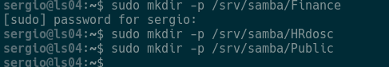

Configure the resource in sudo nano /etc/samba/smb.conf

Add at the end of the file:

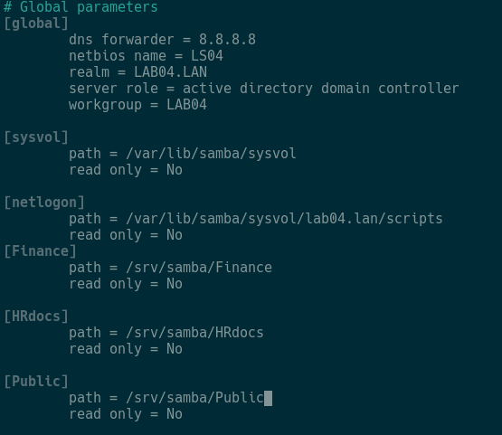

Restart Samba:

sudo systemctl restart smbd


## 2. On the Server: Apply Disk Permissions (ACLs)

First install the ACL tools:
```bash
sudo apt update && sudo apt install acl -y
sudo setfacl -m g:"LAB04\IT_admins":rwx /srv/samba/Finance
```

When executing the command to give permissions to the folders, you will have invalid arguments problems. See some checks:

```bash
getent group | grep -i IT_admins
```

This command will verify the group in Ubuntu AD. If nothing appears, it's because it's not resolving AD users.

Modify:

sudo nano /etc/samba/smb.conf


Add the following specific lines for domain controllers:

### Force NSS Library Binding

Ubuntu does not register the library location. Use these commands to refresh the system:

sudo ln -sf /lib/x86_64-linux-gnu/libnss_winbind.so.2 /lib/x86_64-linux-gnu/libnss_winbind.so

sudo ldconfig


### Cache Cleanup and Full Restart

# Stop the service

sudo systemctl stop samba-ad-dc

# Clear identity caches

sudo net cache flush
sudo rm -f /var/lib/samba/*.tdb
sudo rm -f /var/lib/samba/group_mapping.tdb

# Start the service
sudo systemctl start samba-ad-dc


# Now this command will NOT fail

sudo setfacl -m g:it_admins:rwx /srv/samba/Finance

If it fails, try this:

getent group it_admins
getent group "LAB04\it_admins"


If the groups appear, try this:

sudo nano /etc/nsswitch.conf


For Linux to understand what winbind says, it needs a specific library. If you don't have it, getent will continue to fail. Install it with:

sudo apt update
sudo apt install libnss-winbind libpam-winbind


Now restart the services so they read the new configuration:

sudo systemctl restart winbind
sudo systemctl restart smbd nmbd


Now run again:

getent group "LAB04\it_admins"


### Execute setfacl correctly

Once getent works, launch the command this way (using single quotes so the backslash \ doesn't cause problems):

sudo setfacl -m 'g:LAB04\it_admins:rwx' /srv/samba/Finance
sudo setfacl -m g:it_admins:rwx /srv/samba/HRdosc
sudo setfacl -m g:it_admins:rwx /srv/samba/Public


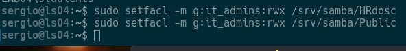

### Permissions for Students (Bob - Restricted Access)

Bob and his group can only modify Public. In the others, they can only see the content (read and execute to enter the folder).

# In Public: Read and Write Permission
sudo setfacl -m g:studients:rwx /srv/samba/Public

# In Finance and HRdocs: Read Only (rx)
sudo setfacl -m g:studients:rx /srv/samba/Finance
sudo setfacl -m g:studients:rx /srv/samba/HRdosc

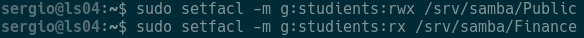

## 3. Permissions for IT_departaments (Charlie - Selective Access)

Charlie can modify his HR folder and the public one, but has no access to Finance.

# In HRdocs: Read and Write Permission
sudo setfacl -m g:it_departaments:rwx /srv/samba/HRdosc

# In Public: Read and Write Permission
sudo setfacl -m g:it_departaments:rwx /srv/samba/Public

# In Finance: Deny all access (remove all permissions)
sudo setfacl -m g:it_departaments:--- /srv/samba/Finance

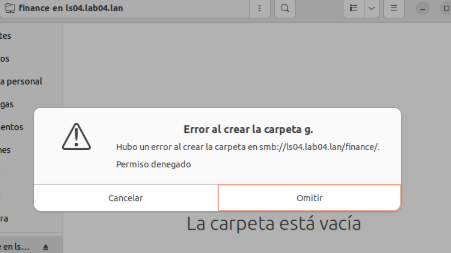

## Disk Preparation (Equivalent to Disk Management)

Add a 10GB disk and identify it on the server.

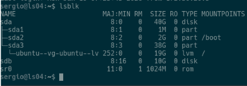

Create GPT partition table and a primary partition:

sudo parted /dev/sdb mklabel gpt
sudo parted /dev/sdb mkpart primary ext4 0% 100%

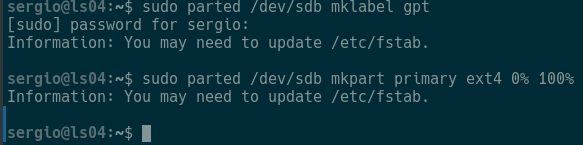

### Format and Assign Label (Equivalent to NTFS and DataDrive)

In Linux we use EXT4 because it's the native standard, although Samba will present it to clients as NTFS.

Format the sdb1 disk:

sudo mkfs.ext4 -L Datadrive /dev/sdb1

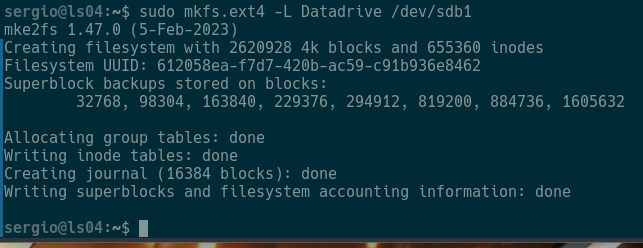

### Mount the Disk and Move Folders (Equivalent to D:\Shares)

In Linux we don't use D:, instead we "mount" the disk to a system folder.

sudo mkdir -p /mnt/Datadrive
sudo mount /dev/sdb1 /mnt/Datadrive

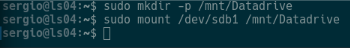

Create the folder structure:

sudo mkdir -p /mnt/Datadrive/shares/Finance
sudo mkdir -p /mnt/Datadrive/shares/HRdosc
sudo mkdir -p /mnt/Datadrive/shares/Public


Move the contents from `/srv/samba` > `/mnt/Datadrive/shares/`:

sudo mv /srv/samba/* /mnt/Datadrive/shares/

Configure the file:

sudo nano /etc/fstab

Add to the very end:

LABEL=Datadrive /mnt/Datadrive ext4 defaults 0 2

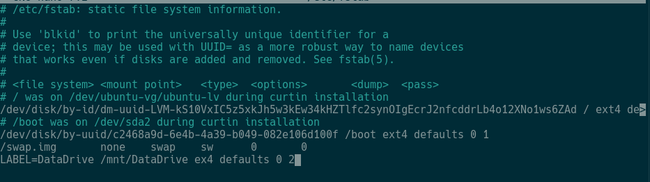

**Note:** Make sure it says `ext4` not `ex4`

Update `sudo nano /etc/samba/smb.conf` since the folders are on a new disk.


Restart Samba:

sudo systemctl restart samba-ad-dc


Check with any of the users.

sudo systemctl restart samba-ad-dc

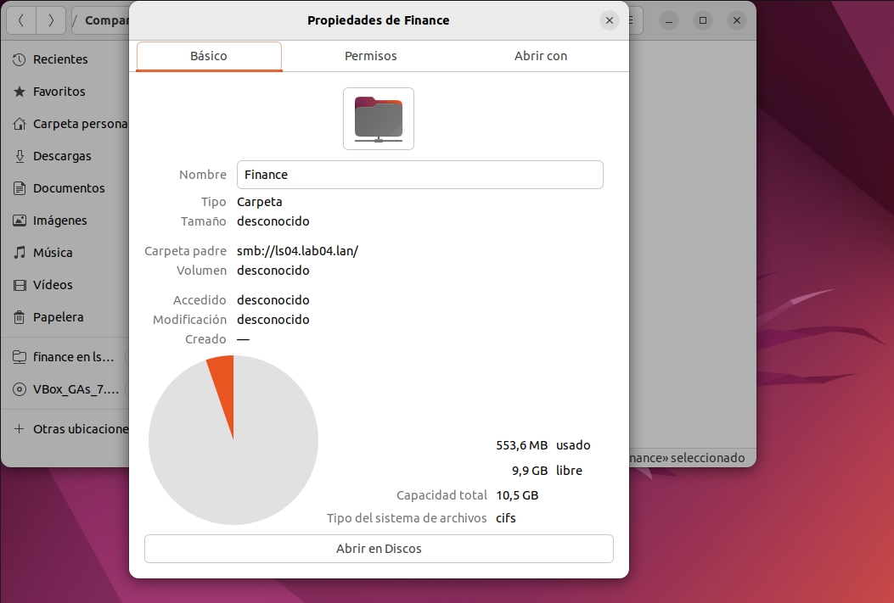

## Create Scheduled Task (Backup)

sudo nano /root/backup.sh

Add the following content:

#!/bin/bash
fecha=$(date +%Y-%m-%d)
echo "Iniciando backup de Finance el $fecha..." >> /var/log/backup_laboratorio.log
tar -czf /mnt/Datadrive/backup_finance_$fecha.tar.gz /mnt/Datadrive/shares/Finance
echo "Backup completado exitosamente." >> /var/log/backup_laboratorio.log


Give execution permissions to the script:

sudo chmod +x /root/backup.sh

Schedule the task for 7pm daily:

sudo crontab -e

First press enter and add to the very end:

0 19 * * * /root/backup.sh


## Basic Security and Auditing

To generate an audit event in Samba logs:

Enable on the server: Check that in smb.conf the [Finance] folder has:

vfs objects = full_audit

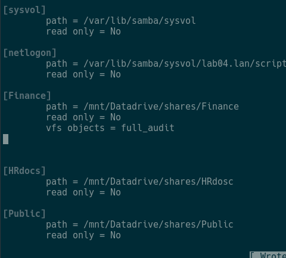

You have to set the permissions again just in case. But with the new path:

sudo setfacl -m 'g:LAB04\it_admins:rwx' /mnt/Datadrive/shares/Finance


Then try to enter with Alice to the Finance folder and try to create/delete, then on the server check the task viewer. If nothing appears with the command to view the task viewer, you need to configure smb.conf again.

## The Train Thing

Install:

sudo apt update
sudo apt install sl

To start the train (on the server):

sl


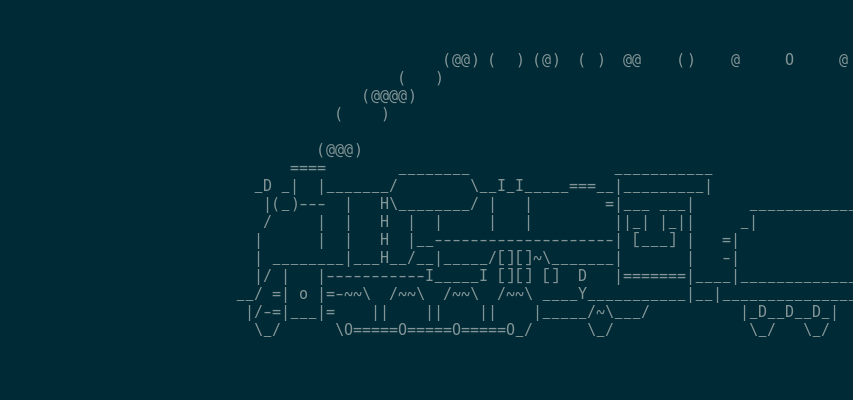

## REMEMBER: Set up SSH on the client

Install:

sudo apt update
sudo apt install openssh-server

To connect:

ssh sergio@172.30.20.39

## On the Client: Open two terminals

In one, type:

ps aux

And in the other to stop:

kill -19 <process_number_from_ps_aux>

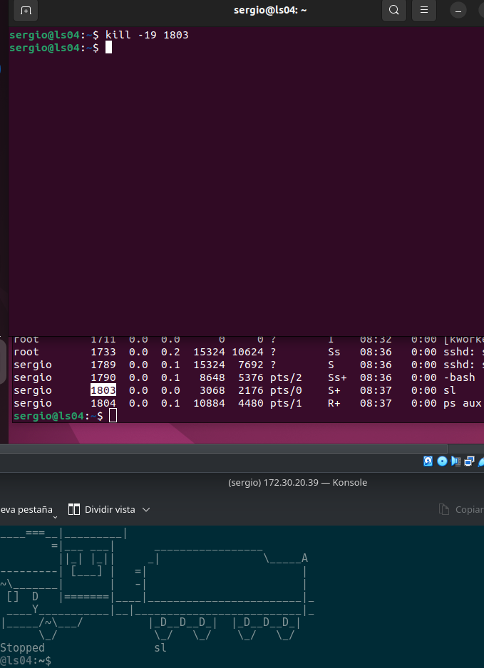

And to resume:

kill -18 <process_number_from_ps_aux>

