# SPRINT 4: Joining a Windows Client to Ubuntu AD Samba Server


## Change the name:


Create a Windows client virtual machine to join the Samba AD domain.

Configure the IP in the server range and verify that there is communication with the server. Remember the second adapter.


A notification will automatically appear to allow other computers to detect the PC, click yes.


## Network Configuration

Configure IP manually:

IP:              192.168.10.40
Subnet Mask:     255.255.255.0
Gateway:         192.168.10.37
Preferred DNS:   192.168.10.37
```

## Check by pinging

ping 192.168.10.37
ping lab04.lan
nslookup lab04.lan


## Now update so that the internet works on the Linux server:

sudo iptables -t nat -A POSTROUTING -o enp0s3 -j MASQUERADE


Check from Windows:

ping zara.es


## Try to join the lab04.lan domain

Go to Work then > join a domain


Enter the domain name and it will ask you to enter the domain account information.

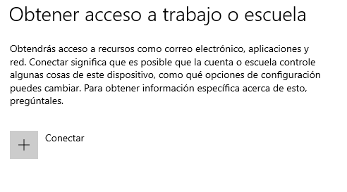


Enter administrator data and then it will ask for the restart of the machine where the domain will appear.

**administrator in lowercase.**

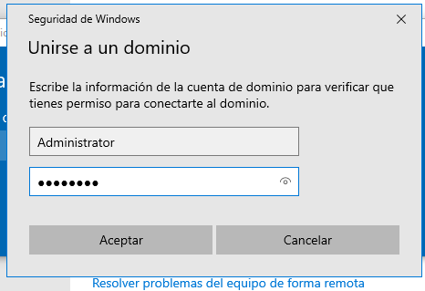

If you have password problems do this on linux:

sudo samba-tool user setpassword administrator


## Internet checks:

After reboot you can login with domain users.

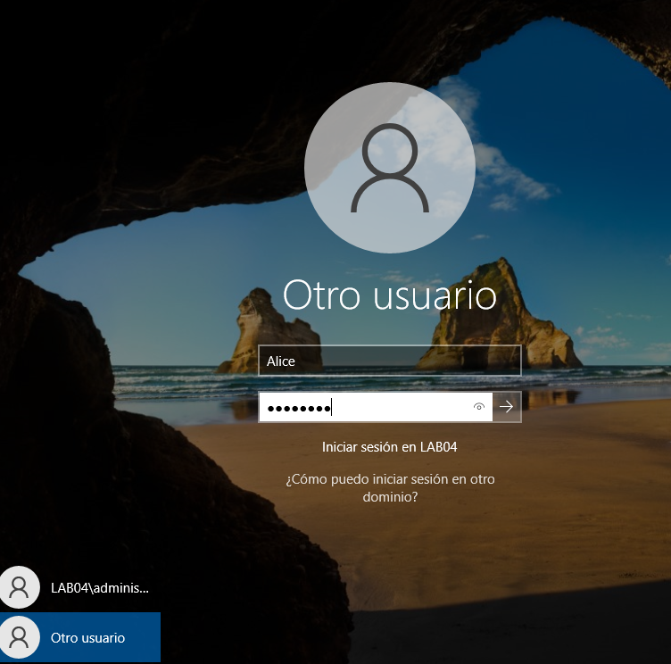


## Check shared folders on windows client

Press `Win + R` > `\\ls04`

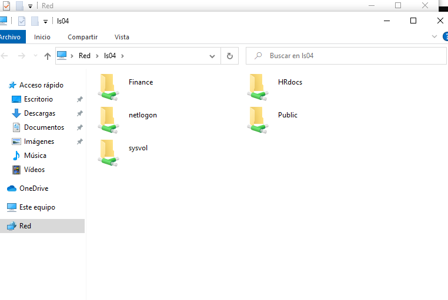

# Trust between two Linux servers

## Creation of the new linux server

## PHASE 3 — Network Configuration (Netplan)

Configure bridge adapter:
- IP: 172.30.20.120/16
- Gateway: 172.30.20.1
- DNS: 10.239.3.7 10.239.3.8

Configure internal network adapter:
- IP: 192.168.10.120 /24
- Gateway: empty
- DNS: 127.0.0.1

Configure the file:

sudo nano /etc/netplan/50-cloud-init.yaml

To set the IP for the bridge adapter that will have internet access and the internal network for clients.

network:
  version: 2
  renderer: networkd
  ethernets:
    enp0s3:
      addresses:
        - 172.30.20.120/16
      routes:
        - to: default
          via: 172.30.20.1
      nameservers:
        addresses:
          - 10.239.3.7
          - 10.239.3.8
    enp0s8:
      addresses:
        - 192.168.10.120/24

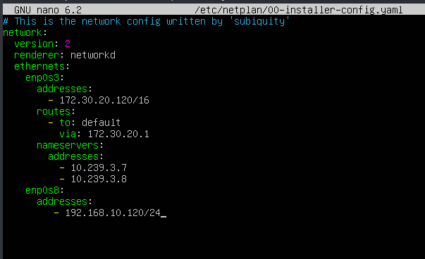

sudo netplan apply

## Change the hostname and fixed IP to an FQDN

Why:
- Active Directory depends on Kerberos, which requires FQDN.
- Samba's internal DNS automatically registers services based on that FQDN.
- Without FQDN hostname, samba-tool domain provision fails or is misconfigured.

Configure the hostname and fixed IP:

sudo hostnamectl set-hostname ls2044


then inside:

sudo nano /etc/hosts

Add the server ip and name so that when I ping ls2044 I get a response:

127.0.0.1 localhost
127.0.1.1 ls2044
192.168.10.120 ls2044.lab2044.lan ls2044


Restart the machine with:

sudo reboot

Verify by pinging the name ls2044 and you automatically get a response.

ping ls2044


---

## PHASE 4 — Prepare server for Samba AD

First I must disable the resolved file:

sudo systemctl disable --now systemd-resolved

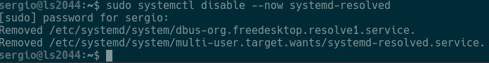

This is where it points to my server to resolve domain names since I am going to implement the samba server because it is incompatible.

The next thing is to remove the symbolic link:

sudo unlink /etc/resolv.conf

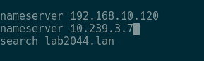

The modifications that are made in this are no longer made if not in the real one.

Create a new resolv.conf file:


sudo nano /etc/resolv.conf

nameserver 192.168.10.120
nameserver 10.239.3.7
search lab2044.lan

Now we make the /etc/resolv.conf file immutable so it cannot change:

sudo chattr +i /etc/resolv.conf

Install samba with the following commands:

sudo apt update
sudo apt install -y acl attr samba samba-dsdb-modules samba-vfs-modules smbclient winbind libpam-winbind libnss-winbind libpam-krb5 krb5-config krb5-user dnsutils chrony net-tools

During installation it will ask for the kerberos server domain, enter the domain **lab2044.lan** This comes out first remember

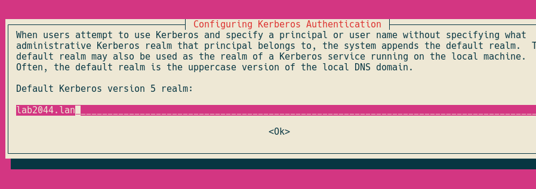

Then it will ask for kerberos servers for your realm, in my case it is: **ls2044.lab2044.lan** and put it again in the next one.


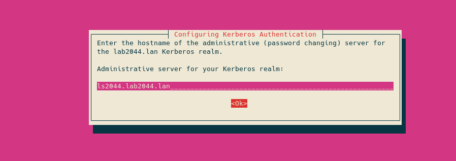

## Disable classic Samba services

Stop and disable Active Directory services that will not be used.

sudo systemctl stop smbd nmbd winbind
sudo systemctl disable smbd nmbd winbind

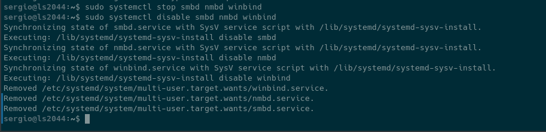

The server only needs samba ad-dc to work as Active Directory:

sudo systemctl unmask samba-ad-dc
sudo systemctl enable samba-ad-dc

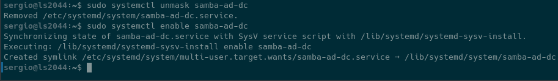

Create a backup of the /etc/samba/smb.conf file:

sudo mv /etc/samba/smb.conf /etc/samba/smb.conf.bak

---

## PHASE 5 — Provision the AD Samba

### Execute provisioning

Run the command:

sudo samba-tool domain provision

Parameters:
- Realm: lab2044.lan
- Domain: LAB2044
- Server Role: dc
- DNS backend: SAMBA_INTERNAL
- DNS forwarder IP: 192.168.10.120 (or 10.239.3.7)

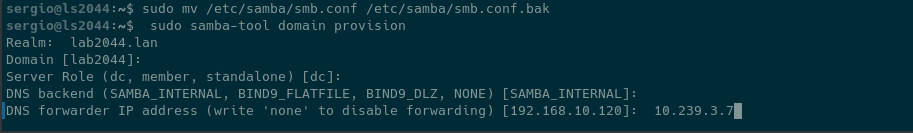

Then create backup of the default kerberos configuration:

sudo mv /etc/krb5.conf /etc/krb5.conf.orig

Replace with the file /var/lib/samba/krb5.conf:

sudo cp /var/lib/samba/private/krb5.conf /etc/krb5.conf

Don't edit anything, leave it because it was already configured:

sudo nano /etc/krb5.conf

---

## PHASE 6 - Activate the domain controller

Start samba Active Directory samba-ad-dc service:

sudo systemctl start samba-ad-dc

Check services:

sudo systemctl status samba-ad-dc

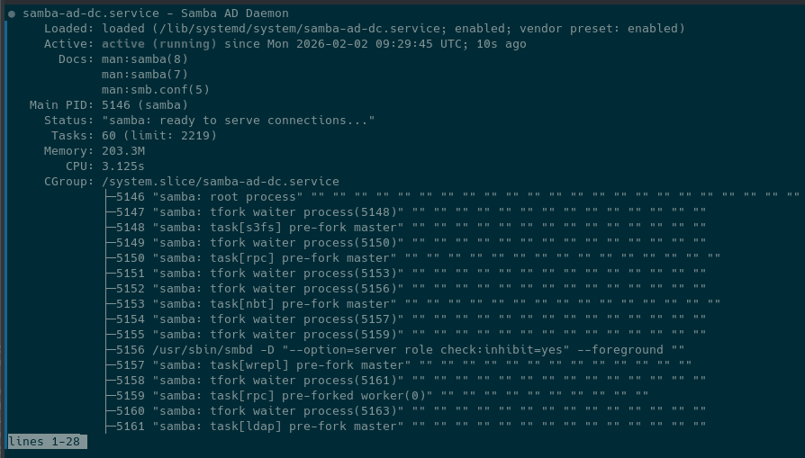

### Configure time synchronization:

Samba Active Directory depends on the kerberos protocol, and the kerberos protocol requires that the AD server and workstation times be synchronized. To ensure proper synchronization, Network Time Protocol (NTP) must be configured on samba.

Change the default permission and ownership of the /var/lib/samba/ntp_signd directory:

sudo chown root:_chrony /var/lib/samba/ntp_signd
sudo chmod 750 /var/lib/samba/ntp_signd

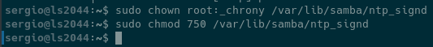

Modify the /etc/chrony/chrony.conf configuration file:

sudo nano /etc/chrony/chrony.conf

At the end of everything add the following lines:

bindcmdaddress 192.168.10.120
allow 192.168.10.0/24
ntpsigndsocket /var/lib/samba/ntp_signd


With this configuration we indicate that the server where the synchronization will be allows the computers that are in the 192.168.10.0/24 network (from 1 to 254) to be able to synchronize.

Restart chrony:

sudo systemctl restart chronyd
sudo systemctl status chronyd

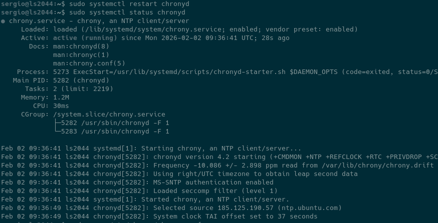

### Verify domain names

host -t A lab2044.lan
host -t A ls2044.lab2044.lan

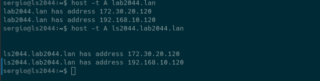

### Verify that the kerberos and ldap service records point to the FQDN

host -t SRV _kerberos._udp.lab2044.lan
host -t SRV _ldap._tcp.lab2044.lan


So that our computers are working through port 88 and the windows client computers that are inside the domain can log in with kerberos authentication.

If you want to verify that the default resources are available in Samba Active Directory:

smbclient -L lab2044.lan -N

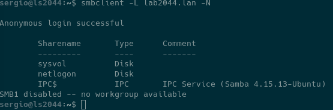

---

## PHASE 7 — Final Validation

Check authentication on the kerberos server using the administrator:

kinit administrator@LAB2044.LAN


klist


---

# Trust Relationship

## Do this on the main one:

sudo chattr -i /etc/resolv.conf

Change it for the second server ls2044 as second DNS in your network configuration or in /etc/resolv.conf temporarily:

sudo nano /etc/resolv.conf

nameserver 192.168.10.37
nameserver 192.168.10.120
nameserver 127.0.0.1
search lab04.lan 

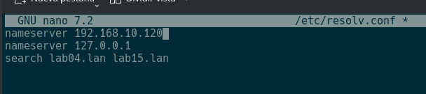

## On the secondary:

sudo chattr -i /etc/resolv.conf
sudo nano /etc/resolv.conf

nameserver 192.168.10.120
nameserver 192.168.10.37
nameserver 10.239.3.7
search lab2044.lan


sudo systemctl restart samba-ad-dc

## Domain Preparation

Functionality verification: Both should respond to their own management commands:

# On each server respectively
samba-tool domain info 127.0.0.1


---

## Creating the Trust Relationship

We will use the samba-tool command to create a bidirectional forest trust. This command runs on LS04.

```bash
sudo samba-tool domain trust create lab2044.lan \
--type=forest \
--direction=both \
--create-location=both \
--user=Administrator@lab2044.lan

Enter the password of the other domain.

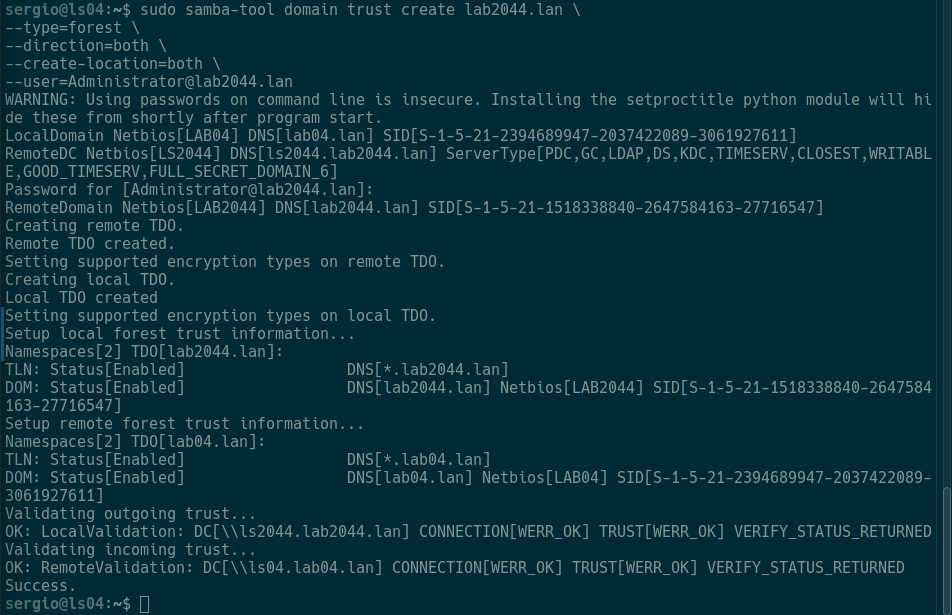

## Validation Tests

Once the trust is created, we must verify that the domains "trust" each other.

On ls04 check:

sudo samba-tool domain trust list


and on ls2044:

sudo samba-tool domain trust list

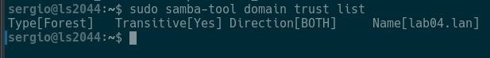

Cross resolution test (nslookup) on both servers:

# On LS04

nslookup lab2044.lan

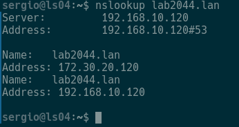

# On LS2044

nslookup lab04.lan


Verify remote users (Winbind):

sudo samba-tool user list -H ldap://lab2044.lan -U Administrator

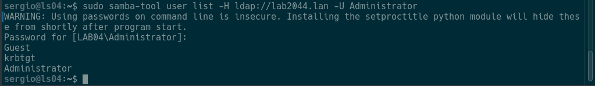

sudo samba-tool user list -H ldap://lab04.lan -U Administrator

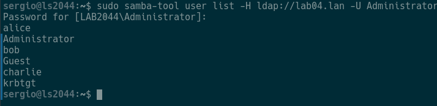

---

## To join a client to the other Domain

Just in case do this on the main server:

sudo iptables -t nat -A POSTROUTING -o enp0s3 -j MASQUERADE


## On the Client:

First:

sudo nano /etc/hosts

Add:

127.0.0.1 localhost
127.0.1.1 lc04
192.168.10.37 lab04.lan
192.168.10.37 ls04.lab04.lan ls04
192.168.10.120 ls2044.lab2044.lan ls2044


Make a backup:

sudo mv /etc/resolv.conf /etc/resolv.conf.backup

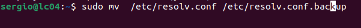

Then put this:

sudo nano /etc/resolv.conf

nameserver 192.168.10.120
nameserver 192.168.10.37

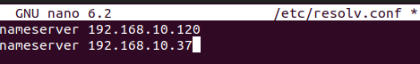

## Log out and do this: On the second server create clients.

sudo samba-tool user create paco
sudo samba-tool user create hola
sudo samba-tool user create vegetta


To check the clients you have on server two:

wbinfo -u


On the first server:

wbinfo -u


And now on the client log out: Log in with a client from server two.

Username: `LAB2044\vegetta`


Once logged in:

LAB2044\vegetta@lc04:~$

