# Samba Active Directory Domain Controller on AWS (Ubuntu)

This guide explains how to install and configure a Samba Active Directory Domain Controller (AD DC) on Ubuntu in AWS, and how to configure a second Linux server as a domain client.

---

# Phase 1 — Configure Hostname and Static IP

## Set Hostname

sudo hostnamectl set-hostname ls204

Edit hosts file:

sudo nano /etc/hosts

Example:

127.0.0.1       localhost
192.168.1.204   ls04.lab04.lan ls04

Reboot:

sudo reboot

---

# Phase 2 — Install Required Packages

Update repositories:

sudo apt update

Install Samba and dependencies:

sudo apt install -y acl attr samba samba-dsdb-modules samba-vfs-modules smbclient winbind libpam-winbind libnss-winbind libpam-krb5 krb5-config krb5-user dnsutils chrony net-tools

When prompted for Kerberos Realm, enter:

LAB04.LAN

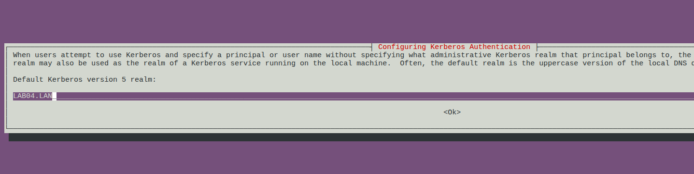

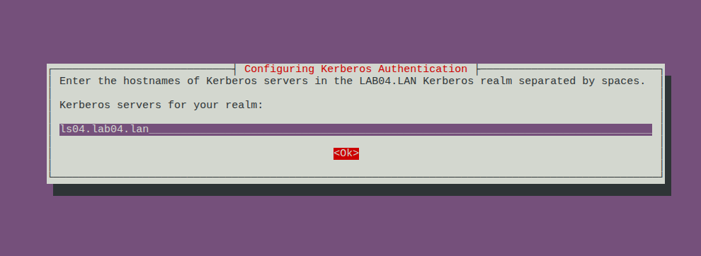

# Phase 3 — Disable Classic Samba Services

Stop and disable services not used by AD DC:

sudo systemctl stop smbd nmbd winbind
sudo systemctl disable smbd nmbd winbind

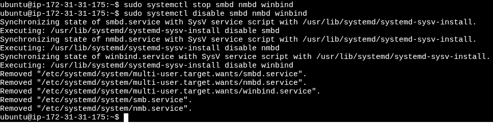

Enable AD DC service:

sudo systemctl unmask samba-ad-dc
sudo systemctl enable samba-ad-dc

---

# Phase 4 — Backup Default Samba Configuration

sudo mv /etc/samba/smb.conf /etc/samba/smb.conf.bak

---

# Phase 5 — Provision Samba Active Directory

Run provisioning:

sudo samba-tool domain provision

Use the following values:

- Realm: `LAB04.LAN`
- Domain: `LAB04`
- Server Role: `dc`
- DNS Backend: `SAMBA_INTERNAL`
- Administrator password: (define strong password)

---

## Configure Kerberos

Backup original file:

sudo mv /etc/krb5.conf /etc/krb5.conf.orig

Copy Samba-generated config:

sudo cp /var/lib/samba/private/krb5.conf /etc/krb5.conf

(Optional verification)

sudo nano /etc/krb5.conf

No modifications are required.

---

# Phase 6 — Disable systemd-resolved (DNS Fix)

Disable service:

sudo systemctl disable --now systemd-resolved

Remove symbolic link:

sudo unlink /etc/resolv.conf

Create new resolv.conf:

sudo nano /etc/resolv.conf

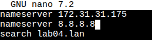

Add:

nameserver 127.0.0.1
search LAB04.LAN

Make file immutable:

sudo chattr +i /etc/resolv.conf

---

# Phase 7 — Start Domain Controller

Start service:

sudo systemctl start samba-ad-dc

Check status:

sudo systemctl status samba-ad-dc

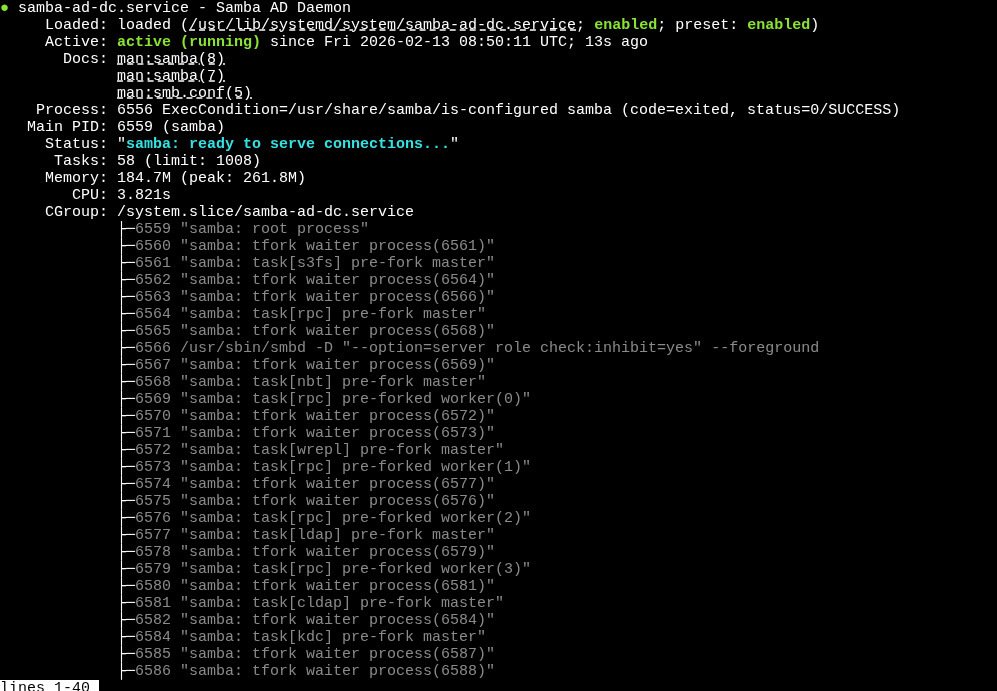

---

# Phase 8 — Validation

Test Kerberos authentication:

kinit administrator@LAB04.LAN

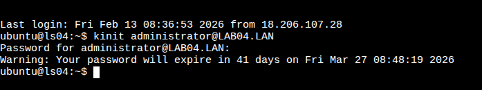

Verify ticket:

klist

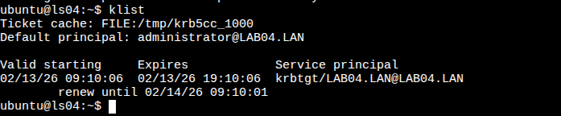

If successful, the Domain Controller is operational.

---

# Configure a Second Linux Server as a Domain Client

su - administrator@LAB04.LAN

If login works, the client server is successfully joined to the domain.

---

## 1. Set the hostname of the client machine:
$ sudo hostnamectl set-hostname cli-ssd

## 2. Hosts File Configuration

Edit the hosts file to add server and domain resolution:
$ sudo nano /etc/hosts

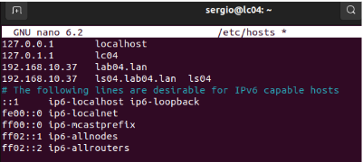

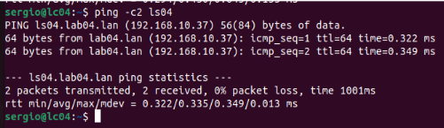

## 3. Connectivity and Internet Test

Verify DNS and internet access:
$ ping lab04.lan
$ ping 8.8.8.8

## 4. Enable IP Forwarding on Server

Edit sysctl configuration:
$ sudo nano /etc/sysctl.conf

Add at the end:
net.ipv4.ip_forward=1

Apply and verify:
$ sudo sysctl -p
$ sysctl net.ipv4.ip_forward

## 5. Configure NAT on Server

Enable NAT so the client can access the internet:
$ sudo iptables -t nat -A POSTROUTING -o enp0s3 -j MASQUERADE
$ sudo iptables -t nat -L -n -v

## 6. Time Synchronization

Server configuration with Chrony:
$ sudo apt update
$ sudo apt install chrony -y
$ sudo nano /etc/chrony/chrony.conf

Modify:
allow 0

Restart and allow NTP:
$ sudo systemctl restart chrony
$ sudo ufw allow 123/udp

Client configuration:
$ sudo nano /etc/systemd/timesyncd.conf
$ sudo systemctl restart systemd-timesyncd
$ timedatectl show-timesync --all

Alternative synchronization method:
$ sudo apt install ntpdate
$ sudo ntpdate lab04.lan
$ sudo ntpdate -q lab04.lan

## 7. Install Required Packages on Ubuntu Desktop

Install required packages:
$ sudo apt update
$ sudo apt install samba krb5-config krb5-user winbind libpam-winbind libnss-winbind

If installation fails:
$ sudo systemctl stop unattended-upgrades
$ sudo kill -9 4363
$ sudo dpkg --configure -a
$ sudo apt install samba krb5-config krb5-user winbind libpam-winbind libnss-winbind

## 8. Kerberos Authentication Test

Test Kerberos authentication:
$ kinit administrator@LAB04.LAN
$ klist

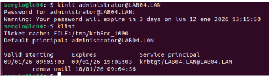

## 9. Kerberos Configuration

Edit Kerberos configuration:
$ sudo nano /etc/krb5.conf

Add:
dns_lookup_realm = true
dns_lookup_kdc = true

## 10. Samba Configuration

Backup and recreate Samba configuration:
$ sudo mv /etc/samba/smb.conf /etc/samba/smb.conf.initial
$ sudo nano /etc/samba/smb.conf

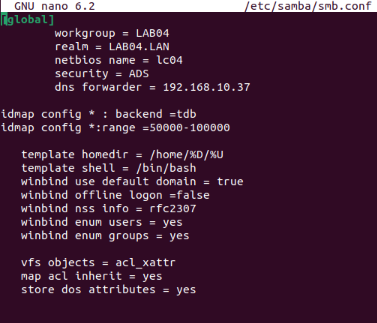

Restart required services:
$ sudo systemctl restart smbd nmbd
$ sudo systemctl stop samba-ad-dc
$ sudo systemctl enable smbd nmbd

## 11. Join Ubuntu Desktop to Samba Active Directory

Join the domain:
$ sudo net ads join -U administrator

Verify on server:
$ sudo samba-tool computer list

## 12. Configure Authentication with Active Directory

Edit NSS configuration:
$ sudo nano /etc/nsswitch.conf

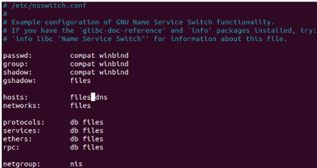

Restart Winbind and verify users:
$ sudo systemctl restart winbind
$ wbinfo -u
$ wbinfo -g
$ getent passwd | grep administrator
$ id administrator

## 13. PAM Configuration for Home Directory Creation

Enable automatic home directory creation:
$ sudo pam-auth-update

Edit PAM configuration:
$ sudo nano /etc/pam.d/common-account

Add at the end:
session required pam_mkhomedir.so skel=/etc/skel/ umask=0022

## 14. Grant Sudo Permissions to Domain Administrator

Add administrator to sudo group:
$ sudo usermod -aG sudo administrator

Login using:
administrator@lab04.lan

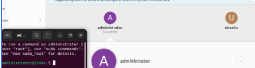

## 15. User and Group Management in Samba AD

Create group and users:
$ sudo samba-tool group add IT_departaments --group-scope=Universal --group-type=Security

$ sudo samba-tool user create alice

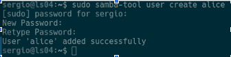

$ sudo samba-tool group addmembers IT_admins alice

## 16. Organizational Units (OU)

Create OU:
$ sudo samba-tool ou create "OU=IT_departaments,DC=lab04,DC=lan"

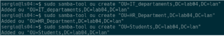

Move users:
$ sudo samba-tool user move alice "OU=IT_departaments,DC=lab04,DC=lan"
$ sudo samba-tool user move bob "OU=Students,DC=lab04,DC=lan"
$ sudo samba-tool user move charlie "OU=HR_Department,DC=lab04,DC=lan"

Move groups:
$ sudo samba-tool group move IT_admins "OU=IT_departaments,DC=lab04,DC=lan"
$ sudo samba-tool group move Students "OU=Students,DC=lab04,DC=lan"
$ sudo samba-tool group move IT_departaments "OU=HR_Department,DC=lab04,DC=lan"

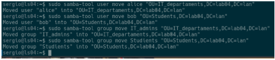

Verify:
$ sudo samba-tool ou list

## 17. Group Policy Objects (GPO)

Create GPO:
$ sudo samba-tool gpo create "IT_Security_Policy" -U Administrator

Link GPO to IT OU:
$ sudo samba-tool gpo setlink "OU=IT_departaments,DC=lab04,DC=lan" {6DCC05BC-2848-4F4E-89E4-44EBE1A4C823} -U Administrator

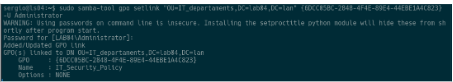

## 18. Password Security Policies

Set domain password policies:
$ sudo samba-tool domain passwordsettings set --min-pwd-length=8

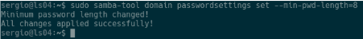

$ sudo samba-tool domain passwordsettings set --account-lockout-threshold=3

$ sudo samba-tool domain passwordsettings set --account-lockout-duration=5

Verify:

## 19. Password Settings Object (PSO)

Create strict PSO:
$ sudo samba-tool domain passwordsettings pso create "PSO_IT_Estricta" 10 --account-lockout-threshold=3 --account-lockout-duration=5 --reset-account-lockout-after=5 -U Administrator

Apply PSO to IT group:
$ sudo samba-tool domain passwordsettings pso apply "PSO_IT_Estricta" "it_admins" -U Administrator

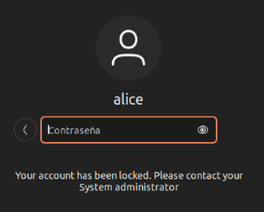

